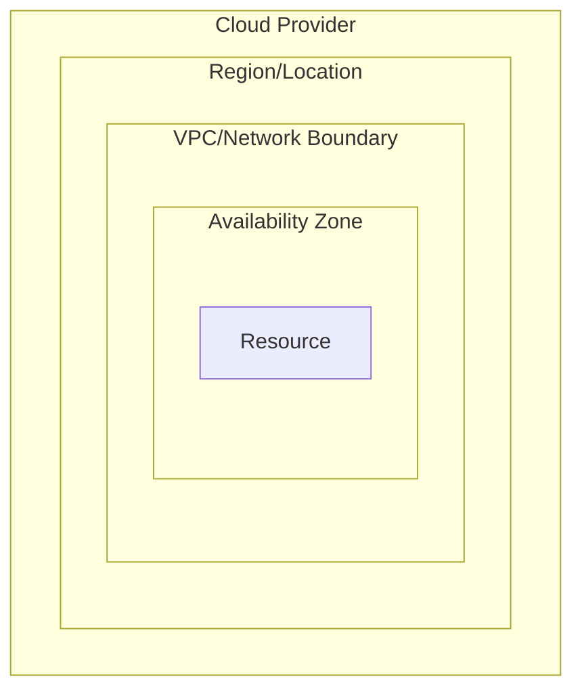
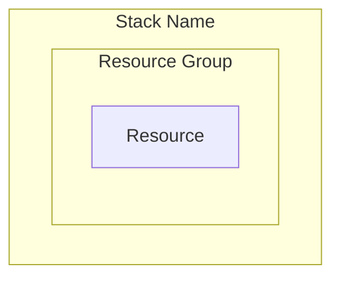

# Visual Standards for Infrastructure Diagrams

This document defines the visual standards and conventions used for creating infrastructure architecture diagrams in this repository.

## Diagram Types

### 1. Individual Stack Diagrams

- **Purpose**: Show resources within a single Pulumi stack
- **Location**: `/stacks/` directory
- **Naming**: `{stack-name}-{environment}.md`
- **Focus**: Internal resource relationships and configurations

### 2. Master Overview Diagrams

- **Purpose**: Show cross-stack dependencies and complete system architecture
- **Location**: `/master/` directory
- **Naming**: `{environment}-infrastructure-overview.md`
- **Focus**: Inter-stack relationships and data flow

## Mermaid Diagram Standards

### Graph Direction

- Use `graph TB` (Top to Bottom) for hierarchical infrastructure layouts
- Use `graph LR` (Left to Right) for process flows and data pipelines

### Color Scheme (AWS-Inspired)

#### Service Categories

```css
classDef iam fill:#DD344C,stroke:#232F3E,stroke-width:2px,color:#fff        /* IAM - Red */
classDef network fill:#3F48CC,stroke:#232F3E,stroke-width:2px,color:#fff     /* Network - Blue */
classDef cluster fill:#FF9900,stroke:#232F3E,stroke-width:2px,color:#fff     /* Compute - Orange */
classDef container fill:#7AA116,stroke:#232F3E,stroke-width:2px,color:#fff   /* Containers - Green */
classDef aws fill:#8C4FFF,stroke:#232F3E,stroke-width:2px,color:#fff         /* AWS Services - Purple */
classDef logs fill:#146EB4,stroke:#232F3E,stroke-width:2px,color:#fff        /* Logging - Dark Blue */
classDef external fill:#879196,stroke:#232F3E,stroke-width:2px,color:#fff    /* External - Gray */
classDef outputs fill:#FF6600,stroke:#232F3E,stroke-width:2px,color:#fff     /* Outputs - Dark Orange */
```

#### Cloud Provider Colors

- **AWS**: Orange (#FF9900) primary, Dark Blue (#232F3E) accents
- **Azure**: Blue (#0078D4) primary, Light Blue (#40E0D0) accents
- **GCP**: Blue (#4285F4) primary, Red (#EA4335), Yellow (#FBBC04), Green (#34A853) accents

### Node Naming Conventions

#### Format

```
[Service Type<br/>Resource Name<br/>Additional Info]
```

#### Examples

```mermaid
VPC[VPC<br/>vpc_id<br/>10.0.0.0/16]
SUBNET[Public Subnet<br/>subnet_id<br/>10.0.1.0/24]
ROLE[IAM Role<br/>ecsInstanceRole_id]
SERVICE[ECS Service<br/>frontendService_id<br/>Desired: 1 task]
```

### Connection Types

#### Solid Lines (Direct Relationships)

- `---|Label|` - Direct resource relationships
- `---|Contains|` - Containment relationships
- `---|Uses|` - Usage relationships

#### Dashed Lines (Logical Relationships)

- `-.->|Label|` - Stack outputs/inputs
- `-.->|Permissions|` - IAM permissions
- `-.->|Data flow|` - Data flow patterns

#### Dotted Lines (Network Traffic)

- `..->|Protocol:Port|` - Network traffic flow
- `..->|HTTP:80|` - Specific protocol and port

### Subgraph Organization

#### Hierarchical Structure



#### Stack Boundaries



## Resource Representation

### AWS Services

#### Compute

- **EC2**: Rectangle with instance type and size
- **ECS**: Container with cluster and service info
- **Lambda**: Function shape with runtime info
- **Fargate**: Serverless container notation

#### Networking

- **VPC**: Large container with CIDR block
- **Subnet**: Nested container with AZ and CIDR
- **Security Group**: Shield-like shape with rules
- **Load Balancer**: Diamond shape with type

#### Storage

- **S3**: Bucket shape with bucket name
- **EBS**: Disk shape with size and type
- **RDS**: Database cylinder with engine type

#### Identity & Access

- **IAM Role**: Rectangle with role name
- **IAM Policy**: Document shape with policy name

### Azure Services

#### Compute

- **Virtual Machine**: Rectangle with VM size
- **Container Instance**: Container with image info
- **App Service**: Web app shape with plan info

#### Networking

- **Virtual Network**: Large container with address space
- **Subnet**: Nested container with address range
- **Network Security Group**: Shield with rules

### GCP Services

#### Compute

- **Compute Engine**: Rectangle with machine type
- **Cloud Run**: Container with service info
- **GKE**: Kubernetes cluster representation

#### Networking

- **VPC**: Network container with IP ranges
- **Subnet**: Regional subnet with CIDR

## Documentation Standards

### File Structure

```
/stacks/
  ├── {stack-name}-{env}.md
  └── ...
/master/
  ├── {env}-infrastructure-overview.md
  └── ...
/templates/
  ├── stack-template.md
  └── master-template.md
```

### Content Sections

#### Required Sections

1. **Title and Description**
2. **Mermaid Diagram**
3. **Resources Summary**
4. **Dependencies** (for stack diagrams)
5. **Architecture Overview** (for master diagrams)

#### Optional Sections

- **Security Configuration**
- **Operational Considerations**
- **Scaling & Availability**
- **Cost Optimization Notes**

### Metadata Standards

#### Resource Information

- Include resource IDs/ARNs where relevant
- Show configuration details (CPU, memory, ports)
- Indicate scaling parameters
- Note security configurations

#### Cross-References

- Link to related stack diagrams
- Reference external dependencies
- Document data flow patterns
- Highlight security boundaries

## Automation & Updates

### Diagram Validation

- Use provided validation scripts in `/scripts/`
- Ensure Mermaid syntax is valid
- Verify all referenced resources exist
- Check for broken cross-references

### Update Triggers

Diagrams should be updated when:

- New resources are added to stacks
- Resource configurations change significantly
- Cross-stack dependencies are modified
- Security configurations are updated
- Network topology changes

### Version Control

- Use descriptive commit messages
- Tag major architecture changes
- Maintain changelog for significant updates
- Review diagrams during infrastructure changes

## Best Practices

### Clarity

- Limit diagram complexity (max 20-25 nodes per diagram)
- Group related resources in subgraphs
- Use consistent naming conventions
- Provide clear connection labels

### Accuracy

- Sync diagrams with actual infrastructure
- Validate resource IDs and configurations
- Update diagrams with infrastructure changes
- Review during deployment processes

### Maintainability

- Use templates for consistent structure
- Automate validation where possible
- Document update procedures
- Establish review processes

### Security

- Avoid exposing sensitive information
- Use generic labels for secrets/keys
- Highlight security boundaries clearly
- Document security group rules appropriately
