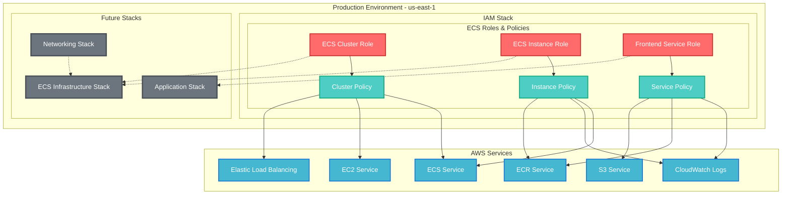

# Production Infrastructure Overview

## Architecture Summary
Complete overview of the production infrastructure. Currently consists of the foundational IAM stack that provides identity and access management for ECS-based workloads.

## Stack Summary
- **iam**: 7 IAM resources (3 roles, 3 policies, 1 provider)

## Master Architecture Diagram

## Data Flow
The IAM stack provides the foundational security layer for ECS-based applications:

1. **ECS Cluster Role**: Manages cluster-level operations and load balancer integration
2. **ECS Instance Role**: Handles container instance registration and image pulling
3. **Frontend Service Role**: Manages application-level permissions for logging and storage

## Security Boundaries
- **IAM Boundary**: All roles follow principle of least privilege
- **Service Isolation**: Each role is scoped to specific ECS components
- **Regional Scope**: All resources deployed in us-east-1

## Stack Relationships
Currently a single foundational stack. Future stacks will reference these IAM roles:

- **ECS Infrastructure Stack**: Will use ecsClusterRole and ecsInstanceRole
- **Application Stack**: Will use frontendServiceRole
- **Networking Stack**: May create additional security group rules referenced by instance policy

## Monitoring & Observability
- CloudWatch Logs permissions configured for all ECS components
- IAM role usage can be monitored through CloudTrail
- Policy effectiveness can be tracked through Access Analyzer

## Next Steps
The infrastructure is ready for:
1. ECS cluster and service definitions
2. Application deployment configurations  
3. Networking and security group setup
4. Load balancer and target group configurations