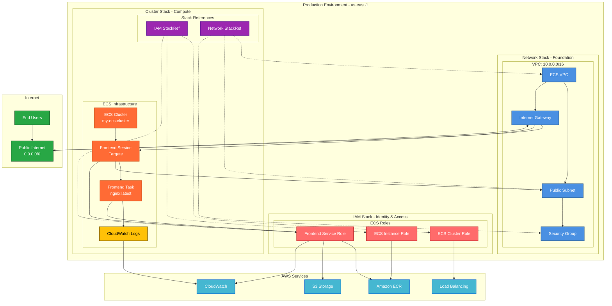
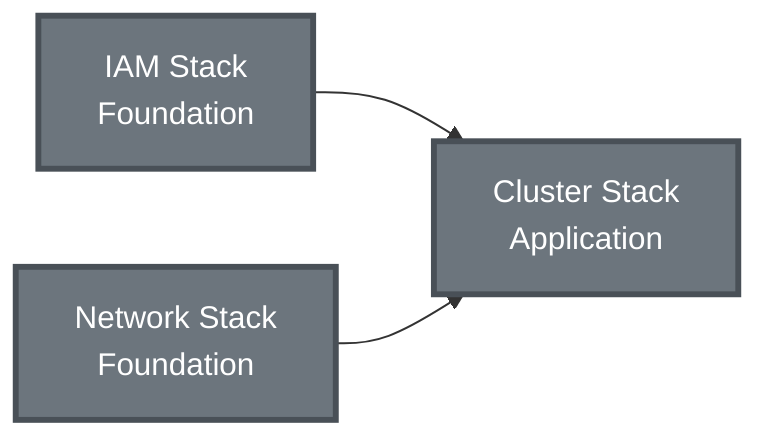

# Production Infrastructure Overview

## Architecture Summary
Complete production ECS infrastructure consisting of three interconnected stacks providing a full containerized application platform. The architecture follows best practices with separated concerns for identity management, networking, and compute resources.

## Stack Summary
- **iam**: 7 IAM resources (3 roles, 3 policies, 1 provider) - Identity & Access Management
- **network**: 6 networking resources (VPC, subnet, IGW, route table, security group) - Network Foundation  
- **cluster**: 4 ECS resources (cluster, task definition, service, log group) - Container Orchestration

**Total**: 17 production resources across 3 stacks with 2 StackReferences for cross-stack integration

## Master Architecture Diagram

## Data Flow & Architecture Patterns

### 1. Identity & Access Management (IAM Stack)
**Foundation Layer**: Provides security roles and policies for all ECS operations
- **ECS Cluster Role**: Manages cluster-level operations and load balancer integration
- **ECS Instance Role**: Handles container instance registration and ECR access
- **Frontend Service Role**: Application-level permissions for logging, ECR, and S3

### 2. Network Foundation (Network Stack)  
**Infrastructure Layer**: Establishes secure, scalable networking
- **VPC Isolation**: 10.0.0.0/16 private network with internet connectivity
- **Public Subnet**: Hosts Fargate tasks with public IP assignment
- **Security Groups**: Network-level access control for services
- **Internet Gateway**: Enables public internet access for applications

### 3. Container Orchestration (Cluster Stack)
**Application Layer**: Runs containerized workloads using cross-stack resources
- **ECS Fargate**: Serverless container execution
- **Task Definitions**: Container specifications with IAM role integration
- **Services**: Maintains desired container count with network placement
- **CloudWatch Logs**: Centralized logging for all containers

## Stack Relationships & Dependencies

### Cross-Stack Integration
- **Cluster → IAM**: Uses StackReference to access role ARNs
- **Cluster → Network**: Uses StackReference to access VPC, subnet, and security group IDs
- **No circular dependencies**: Clean separation of concerns

## Security Boundaries

### Network Security
- **VPC Isolation**: All resources within private 10.0.0.0/16 network
- **Security Groups**: Service-level firewall rules
- **Public Subnet**: Controlled internet access for frontend services

### Identity Security  
- **Principle of Least Privilege**: Each role has minimal required permissions
- **Service Isolation**: Separate roles for cluster, instance, and application concerns
- **Cross-Stack Security**: IAM roles shared securely via StackReferences

### Container Security
- **Fargate Isolation**: Serverless execution with AWS-managed infrastructure
- **Task-Level IAM**: Individual container permissions via task roles
- **Log Isolation**: Dedicated log groups per service

## Scalability & Expansion

### Current Capacity
- **ECS Service**: 1 frontend task (can scale horizontally)
- **Network**: Single public subnet (can add private subnets)
- **Compute**: Fargate serverless (auto-scaling available)

### Expansion Patterns
- **Multi-AZ Deployment**: Add subnets in additional availability zones
- **Load Balancing**: Integrate Application Load Balancer for high availability
- **Service Mesh**: Add additional ECS services with service discovery
- **Database Layer**: Add RDS or DynamoDB with private subnet placement

## Monitoring & Observability

### Current Monitoring
- **CloudWatch Logs**: Container application logs
- **ECS Metrics**: Service and task-level metrics
- **VPC Flow Logs**: Network traffic monitoring (can be enabled)

### Monitoring Expansion
- **Application Performance Monitoring**: Add APM tools
- **Custom Metrics**: Application-specific CloudWatch metrics
- **Alerting**: CloudWatch alarms for service health
- **Distributed Tracing**: X-Ray integration for request tracing

## Disaster Recovery & High Availability

### Current State
- **Single AZ**: Resources in one availability zone
- **Stateless Applications**: Easy to recreate and scale
- **Infrastructure as Code**: Complete environment reproducible via Pulumi

### HA Improvements
- **Multi-AZ**: Deploy across multiple availability zones
- **Load Balancing**: Distribute traffic across healthy instances
- **Auto Scaling**: Automatic capacity adjustment based on demand
- **Database Replication**: Add read replicas for data layer

## Cost Optimization

### Current Costs
- **Fargate**: Pay-per-use serverless compute
- **VPC**: No additional charges for basic networking
- **CloudWatch**: Log storage and basic metrics

### Optimization Opportunities
- **Reserved Capacity**: For predictable workloads
- **Spot Instances**: For fault-tolerant batch workloads
- **Log Retention**: Optimize CloudWatch log retention policies
- **Resource Right-Sizing**: Monitor and adjust CPU/memory allocations