# Production Infrastructure Overview

## Architecture Summary
Complete production infrastructure consisting of four interconnected stacks providing identity management, dual networking approaches, container orchestration, and storage. The architecture demonstrates both a simple networking setup and a more comprehensive VPC design with public/private subnet segmentation.

## Stack Summary
- **iam**: 7 IAM resources (3 roles, 3 policies, 1 provider) - Identity & Access Management
- **network**: 6 networking resources (VPC, subnet, IGW, route table, security group) - Simple Network Foundation
- **networking_and_bucket**: 15 resources (VPC, subnets, NAT, S3) - Comprehensive Network & Storage
- **cluster**: 4 ECS resources (cluster, task definition, service, log group) - Container Orchestration

**Total**: 32 production resources across 4 stacks with 2 StackReferences for cross-stack integration

## Master Architecture Diagram

```mermaid
graph TB
    %% Define AWS service icon styles
    classDef awsSecurity fill:#FF9900,stroke:#232F3E,stroke-width:2px,color:#fff
    classDef awsNetwork fill:#FF9900,stroke:#232F3E,stroke-width:2px,color:#fff
    classDef awsCompute fill:#FF9900,stroke:#232F3E,stroke-width:2px,color:#fff
    classDef awsMonitoring fill:#FF9900,stroke:#232F3E,stroke-width:2px,color:#fff
    classDef awsStorage fill:#FF9900,stroke:#232F3E,stroke-width:2px,color:#fff
    classDef stackref fill:#9C27B0,stroke:#6A1B9A,stroke-width:2px,color:#fff
    classDef internet fill:#28A745,stroke:#155724,stroke-width:2px,color:#fff
    classDef users fill:#17A2B8,stroke:#117A8B,stroke-width:2px,color:#fff

    subgraph "🏗️ Production Environment - us-east-1"
        subgraph "🔐 IAM Stack - Identity & Access"
            subgraph "Security Roles"
                ECR["🔑 ECS Cluster Role<br/>Cluster Management"]:::awsSecurity
                EIR["🔑 ECS Instance Role<br/>Instance Management"]:::awsSecurity
                FSR["🔑 Frontend Service Role<br/>Task Execution"]:::awsSecurity
            end
        end

        subgraph "🌐 Network Stack - Simple Foundation"
            subgraph "Basic VPC Infrastructure"
                VPC_SIMPLE["🏢 ECS VPC<br/>10.0.0.0/16<br/>Basic Setup"]:::awsNetwork
                SUBNET_SIMPLE["🌍 Public Subnet<br/>ECS Tasks"]:::awsNetwork
                IGW_SIMPLE["🚪 Internet Gateway<br/>Simple Access"]:::awsNetwork
                SG_SIMPLE["🔒 Security Group<br/>ECS Rules"]:::awsSecurity
            end
        end

        subgraph "🌐 Networking & Bucket Stack - Comprehensive Infrastructure"
            subgraph "Advanced VPC Architecture"
                VPC_ADV["🏢 Main VPC<br/>10.29.0.0/16<br/>Full Featured"]:::awsNetwork
                
                subgraph "Public Tier"
                    PUB1["🌐 Public Subnet 1<br/>10.29.1.0/24"]:::awsNetwork
                    PUB2["🌐 Public Subnet 2<br/>10.29.2.0/24"]:::awsNetwork
                end
                
                subgraph "Private Tier"
                    PRIV1["🏠 Private Subnet<br/>10.29.10.0/24"]:::awsNetwork
                end
                
                subgraph "NAT Infrastructure"
                    NAT["🔄 NAT Gateway<br/>54.173.5.81"]:::awsNetwork
                    EIP["📍 Elastic IP<br/>NAT Gateway"]:::awsNetwork
                end
                
                IGW_ADV["🚪 Internet Gateway<br/>Advanced Access"]:::awsNetwork
            end
            
            subgraph "Storage Layer"
                S3["💾 S3 Bucket<br/>Object Storage<br/>AES256 Encrypted"]:::awsStorage
            end
        end

        subgraph "🐳 Cluster Stack - Compute"
            subgraph "ECS Infrastructure"
                CLUSTER["🏗️ ECS Cluster<br/>my-ecs-cluster"]:::awsCompute
                TASKDEF["📦 Frontend Task<br/>nginx:latest<br/>Fargate"]:::awsCompute
                SERVICE["⚙️ Frontend Service<br/>Desired: 1"]:::awsCompute
                LOGS["📝 CloudWatch Logs<br/>/ecs/frontend-task"]:::awsMonitoring
            end

            subgraph "Cross-Stack References"
                IAM_REF["🔗 IAM StackRef<br/>Role ARNs"]:::stackref
                NET_REF["🔗 Network StackRef<br/>Simple VPC Resources"]:::stackref
            end
        end
    end

    subgraph "🌐 AWS Services"
        ECR_SVC["📦 Amazon ECR<br/>Container Registry"]:::awsStorage
        CW["📊 CloudWatch<br/>Monitoring"]:::awsMonitoring
        ELB["⚖️ Load Balancing<br/>Future Enhancement"]:::awsNetwork
    end

    subgraph "🌍 External"
        INTERNET["🌐 Public Internet<br/>0.0.0.0/0"]:::internet
        USERS["👥 End Users<br/>Web Traffic"]:::users
    end

    %% Cross-stack relationships via StackReferences
    IAM_REF -.-> ECR
    IAM_REF -.-> EIR
    IAM_REF -.-> FSR
    NET_REF -.-> VPC_SIMPLE
    NET_REF -.-> SUBNET_SIMPLE
    NET_REF -.-> SG_SIMPLE

    %% Simple Network Stack relationships
    VPC_SIMPLE --> SUBNET_SIMPLE
    VPC_SIMPLE --> IGW_SIMPLE
    SUBNET_SIMPLE --> SG_SIMPLE
    IGW_SIMPLE --> INTERNET

    %% Advanced Network Stack relationships
    VPC_ADV --> PUB1
    VPC_ADV --> PUB2
    VPC_ADV --> PRIV1
    VPC_ADV --> IGW_ADV
    EIP --> NAT
    NAT --> PUB1
    IGW_ADV --> INTERNET

    %% ECS relationships
    CLUSTER --> SERVICE
    SERVICE --> TASKDEF
    TASKDEF --> LOGS

    %% Service execution relationships (uses simple network)
    SERVICE --> SUBNET_SIMPLE
    SERVICE --> FSR
    TASKDEF --> FSR

    %% External service relationships
    FSR --> ECR_SVC
    FSR --> S3
    FSR --> CW
    ECR --> ELB
    EIR --> ECR_SVC
    LOGS --> CW

    %% User traffic flow (through simple network currently)
    USERS --> INTERNET
    INTERNET --> IGW_SIMPLE
    IGW_SIMPLE --> SERVICE

    %% Advanced network potential connections (dotted for future use)
    INTERNET -.-> IGW_ADV
    IGW_ADV -.-> PUB1
    IGW_ADV -.-> PUB2
    PRIV1 -.-> NAT
    NAT -.-> IGW_ADV
```

## Data Flow & Architecture Patterns

### 1. 🔐 Identity & Access Management (IAM Stack)

**Foundation Layer**: Provides security roles and policies for all ECS operations
- **ECS Cluster Role**: Manages cluster-level operations and load balancer integration
- **ECS Instance Role**: Handles container instance registration and ECR access
- **Frontend Service Role**: Application-level permissions for logging, ECR, and S3

### 2. 🌐 Dual Network Architecture

**Current Active Network (Simple)**:
- **network stack**: Basic VPC (10.0.0.0/16) used by ECS cluster
- **Single public subnet**: Hosts current Fargate tasks
- **Simple internet connectivity**: Direct IGW access

**Advanced Network (Available)**:
- **networking_and_bucket stack**: Comprehensive VPC (10.29.0.0/16)
- **Public/Private subnet separation**: Production-ready architecture
- **NAT Gateway**: Secure outbound access for private resources
- **S3 Storage**: Integrated object storage with encryption

### 3. 🐳 Container Orchestration (Cluster Stack)
**Application Layer**: Runs containerized workloads using simple network stack
- **ECS Fargate**: Serverless container execution
- **Task Definitions**: Container specifications with IAM role integration
- **Services**: Maintains desired container count with network placement
- **CloudWatch Logs**: Centralized logging for all containers

## Stack Relationships & Dependencies

```mermaid
graph LR
    classDef stack fill:#6C757D,stroke:#495057,stroke-width:3px,color:#fff
    classDef active fill:#28A745,stroke:#155724,stroke-width:3px,color:#fff
    classDef available fill:#FFC107,stroke:#E0A800,stroke-width:3px,color:#fff

    IAM["🔐 IAM Stack<br/>Foundation"]:::stack
    NETWORK["🌐 Network Stack<br/>Active Network"]:::active
    NETBUCKET["🌐 Networking & Bucket<br/>Advanced Network"]:::available
    CLUSTER["🐳 Cluster Stack<br/>Application"]:::stack

    IAM --> CLUSTER
    NETWORK --> CLUSTER
    NETBUCKET -.-> CLUSTER
```

### Cross-Stack Integration
- **Cluster → IAM**: Uses StackReference to access role ARNs
- **Cluster → Network**: Uses StackReference to access simple VPC resources
- **Networking & Bucket**: Available for future migration or additional services
- **No circular dependencies**: Clean separation of concerns

## Network Architecture Comparison

| Feature | Simple Network Stack | Networking & Bucket Stack |
|---------|---------------------|---------------------------|
| **VPC CIDR** | 10.0.0.0/16 | 10.29.0.0/16 |
| **Subnets** | 1 Public | 2 Public + 1 Private |
| **NAT Gateway** | ❌ None | ✅ With Elastic IP |
| **Storage** | ❌ None | ✅ S3 Bucket |
| **Current Usage** | ✅ Active (ECS) | ⏳ Available |
| **Architecture** | Basic | Production-ready |

## Security Boundaries

### Network Security
- **Active VPC Isolation**: ECS resources in 10.0.0.0/16 network
- **Available Advanced Security**: Public/private subnet separation in 10.29.0.0/16
- **Security Groups**: Service-level firewall rules
- **NAT Gateway**: Secure outbound access (available in advanced network)

### Identity Security
- **Principle of Least Privilege**: Each role has minimal required permissions
- **Service Isolation**: Separate roles for cluster, instance, and application concerns
- **Cross-Stack Security**: IAM roles shared securely via StackReferences

### Container Security
- **Fargate Isolation**: Serverless execution with AWS-managed infrastructure
- **Task-Level IAM**: Individual container permissions via task roles
- **Log Isolation**: Dedicated log groups per service

### Storage Security
- **S3 Encryption**: AES256 server-side encryption (available)
- **Access Control**: Default bucket policies block public access
- **Regional Storage**: Data stored in us-east-1 region

## Migration & Expansion Opportunities

### Network Migration Path
1. **Current State**: ECS using simple network stack (10.0.0.0/16)
2. **Migration Option**: Move ECS to advanced network stack (10.29.0.0/16)
3. **Benefits**: Private subnet placement, NAT Gateway, S3 integration

### Scalability Patterns

#### Current Capacity
- **ECS Service**: 1 frontend task (can scale horizontally)
- **Simple Network**: Single public subnet
- **Advanced Network**: Multi-subnet architecture ready
- **Compute**: Fargate serverless (auto-scaling available)

#### Expansion Opportunities
- **Multi-AZ Deployment**: Leverage advanced network's subnet architecture
- **Load Balancing**: Integrate ALB with advanced network's public subnets
- **Database Layer**: Use private subnets for RDS/DynamoDB
- **Microservices**: Deploy additional services across both networks

## Monitoring & Observability

### Current Monitoring
- **CloudWatch Logs**: Container application logs
- **ECS Metrics**: Service and task-level metrics
- **VPC Flow Logs**: Available for both networks

### Monitoring Expansion
- **Cross-Network Monitoring**: Monitor both VPC environments
- **S3 Access Logging**: Track storage usage patterns
- **NAT Gateway Metrics**: Monitor outbound traffic costs
- **Custom Dashboards**: Unified view across all stacks

## Cost Optimization

### Current Costs
- **Fargate**: Pay-per-use serverless compute
- **Simple VPC**: No additional networking charges
- **Advanced VPC**: NAT Gateway hourly + data processing fees
- **S3**: Pay-per-use storage (available)

### Optimization Strategies
- **Network Consolidation**: Migrate to single network architecture
- **NAT Gateway Usage**: Monitor data transfer costs
- **S3 Storage Classes**: Use appropriate classes for access patterns
- **Resource Right-Sizing**: Monitor and adjust allocations

## Disaster Recovery & High Availability

### Current State
- **Single AZ**: Resources primarily in one availability zone
- **Dual Network Options**: Flexibility for failover scenarios
- **Stateless Applications**: Easy to recreate and scale
- **Infrastructure as Code**: Complete environment reproducible via Pulumi

### HA Improvements
- **Multi-AZ**: Deploy across multiple availability zones using advanced network
- **Load Balancing**: Distribute traffic across healthy instances
- **Cross-Network Redundancy**: Utilize both network stacks for resilience
- **Database Replication**: Add read replicas in private subnets

## Recommendations

### Short Term
1. **Evaluate Network Usage**: Determine if advanced network features are needed
2. **Cost Analysis**: Compare simple vs advanced network costs
3. **Migration Planning**: Plan ECS migration to advanced network if beneficial

### Long Term
1. **Network Consolidation**: Standardize on single network architecture
2. **Multi-AZ Expansion**: Leverage advanced network for high availability
3. **Service Mesh**: Implement service discovery across network boundaries
4. **Monitoring Integration**: Unified observability across all stacks

## Notes
This infrastructure demonstrates:
- **Flexible Architecture**: Multiple networking options for different use cases
- **Proper Separation**: Clean stack boundaries with cross-stack references
- **Scalability Options**: Both simple and advanced networking patterns
- **Security Best Practices**: IAM roles, VPC isolation, encryption
- **Cost Awareness**: Options for both cost-optimized and feature-rich deployments

The dual network approach provides flexibility for different workload requirements while maintaining clean architectural boundaries.