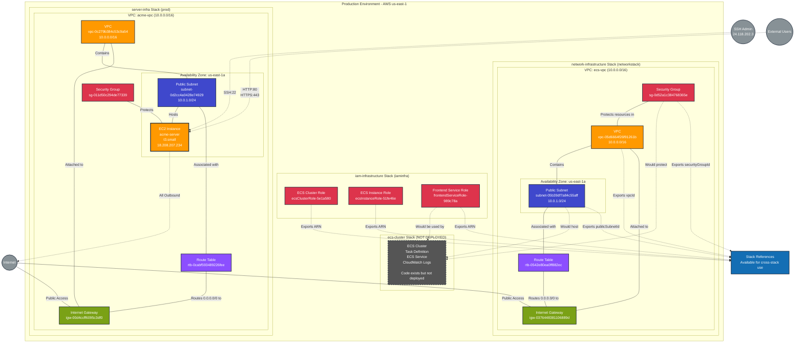

# Production Infrastructure - Complete Overview

This diagram shows the complete production infrastructure architecture across all deployed Pulumi stacks.



## Infrastructure Summary

### Deployed Production Stacks

There are **3 deployed stacks** in production:

| Stack | Project | Resources | Purpose | Status |
|-------|---------|-----------|---------|--------|
| iaminfra | iam-infrastructure | 8 | IAM roles for ECS | ✅ Deployed |
| networkstack | network-infrastructure | 8 | ECS networking infrastructure | ✅ Deployed |
| prod | server-infra | 10 | ACME server infrastructure | ✅ Deployed |

### Planned But Not Deployed

| Stack | Project | Resources | Purpose | Status |
|-------|---------|-----------|---------|--------|
| (varies) | ecs-cluster | 0 | ECS cluster with Fargate | ❌ Code exists, not deployed |

### Total Resource Count

- **Deployed Resources**: 26 managed resources across 3 stacks
- **Cloud Provider**: AWS
- **Region**: us-east-1
- **Account**: 052848974346

## Architecture Overview

### Infrastructure Organization

The production environment consists of **two separate infrastructure groups**:

#### 1. ECS Foundation (Prepared, Not Active)

**Purpose**: Foundational infrastructure for containerized workloads using ECS Fargate

**Stacks**:
- **iam-infrastructure/iaminfra**: IAM roles and policies for ECS operations
- **network-infrastructure/networkstack**: VPC, subnet, and security groups for ECS

**Status**: Infrastructure is deployed and ready, but no ECS cluster/services are running yet

**Design**:
- VPC: 10.0.0.0/16 (ecs-vpc)
- Public Subnet: 10.0.1.0/24 in us-east-1a
- Security Group: Allows HTTP (80) and SSH (22) from anywhere
- IAM Roles: Cluster role, instance role, and task execution role

**Stack Dependencies**:
```
iam-infrastructure (iaminfra)
         ↓
network-infrastructure (networkstack)
         ↓
ecs-cluster (NOT DEPLOYED)
```

#### 2. ACME Server (Active)

**Purpose**: Standalone EC2 instance running ACME server for certificate management

**Stacks**:
- **server-infra/prod**: Complete infrastructure for ACME server

**Status**: Fully deployed and operational

**Design**:
- VPC: 10.0.0.0/16 (acme-vpc)
- Public Subnet: 10.0.1.0/24 in us-east-1a
- EC2 Instance: t3.small with public IP 18.208.207.234
- Security Group: SSH restricted to 24.118.202.3/32, HTTP/HTTPS open

**Stack Dependencies**: None (standalone)

## Network Architecture

### ECS Infrastructure Network (ecs-vpc)

- **VPC CIDR**: 10.0.0.0/16
- **Subnet CIDR**: 10.0.1.0/24 (us-east-1a)
- **Internet Gateway**: igw-0376448381106889d
- **Route Table**: Routes 0.0.0.0/0 to Internet Gateway
- **Security Group**: HTTP (80) and SSH (22) from 0.0.0.0/0

**Purpose**: Ready to host ECS Fargate tasks when cluster is deployed

### ACME Server Network (acme-vpc)

- **VPC CIDR**: 10.0.0.0/16
- **Subnet CIDR**: 10.0.1.0/24 (us-east-1a)
- **Internet Gateway**: igw-00d4ccff6095c3df0
- **Route Table**: Routes 0.0.0.0/0 to Internet Gateway
- **Security Group**: SSH from 24.118.202.3/32, HTTP/HTTPS from 0.0.0.0/0

**Purpose**: Hosts ACME server EC2 instance

### Network Isolation

The two infrastructure groups use **separate VPCs** with no peering or connectivity:
- ECS infrastructure: vpc-05d6664f26f91261b
- ACME server: vpc-0c279b384c53c9a54

This provides complete isolation between the two environments.

## IAM Architecture

### Roles and Purposes

| Role | ARN | Purpose | Used By |
|------|-----|---------|---------|
| ecsClusterRole | arn:aws:iam::052848974346:role/ecsClusterRole-5e1a580 | ECS cluster management | ECS service (when deployed) |
| ecsInstanceRole | arn:aws:iam::052848974346:role/ecsInstanceRole-51fe46e | EC2 instance ECS agent | EC2 instances (when deployed) |
| frontendServiceRole | arn:aws:iam::052848974346:role/frontendServiceRole-989c78a | ECS task execution | ECS tasks (when deployed) |

### Permission Scope

- **ECS Cluster Role**: EC2, ELB, and ECS management operations
- **ECS Instance Role**: ECS agent, CloudWatch Logs, ECR, and EC2 security groups
- **Frontend Service Role**: CloudWatch Logs, ECR, and S3 access

## Compute Resources

### Active Compute

| Resource | Type | Location | Status | Public IP |
|----------|------|----------|--------|-----------|
| acme-server | EC2 t3.small | acme-vpc/us-east-1a | running | 18.208.207.234 |

### Planned Compute (Not Deployed)

| Resource | Type | Location | Status |
|----------|------|----------|--------|
| ECS Cluster | Fargate | ecs-vpc/us-east-1a | Not deployed |
| Frontend Task | Fargate (nginx) | ecs-vpc/us-east-1a | Not deployed |

## Security Configuration

### ACME Server Security

**Security Group**: sg-011d50c294de77339
- **Inbound**:
  - SSH (22): 24.118.202.3/32 ✅ Restricted
  - HTTP (80): 0.0.0.0/0 (ACME challenges)
  - HTTPS (443): 0.0.0.0/0 (ACME protocol)
- **Outbound**: All traffic to 0.0.0.0/0

### ECS Infrastructure Security

**Security Group**: sg-0d52a1c384768365e
- **Inbound**:
  - HTTP (80): 0.0.0.0/0 ⚠️ Broad access
  - SSH (22): 0.0.0.0/0 ⚠️ Broad access
- **Outbound**: All traffic to 0.0.0.0/0

**Recommendation**: Restrict SSH access when ECS cluster is deployed

## Cross-Stack Dependencies

### Active Dependencies

Currently, there are **no active cross-stack dependencies** because:
- ACME server stack is standalone
- ECS cluster stack is not deployed

### Prepared Dependencies (Ready for Use)

When the ECS cluster stack is deployed, it will reference:

```
ecs-cluster stack
    ↓ (references)
iam-infrastructure/iaminfra
    - frontendServiceRoleArn (for task execution)
    ↓ (references)
network-infrastructure/networkstack
    - publicSubnetId (for task placement)
    - securityGroupId (for network access)
```

### Stack Outputs Available

**iam-infrastructure/iaminfra exports**:
- ecsClusterRoleArn
- ecsInstanceRoleArn
- frontendServiceRoleArn

**network-infrastructure/networkstack exports**:
- vpcId
- publicSubnetId
- securityGroupId

**server-infra/prod exports**: None (standalone stack)

## Data Flow Patterns

### ACME Server Traffic Flow

**Inbound**:
```
Internet → Internet Gateway → Route Table → Public Subnet → Security Group → EC2 Instance
```

**Outbound**:
```
EC2 Instance → Security Group → Public Subnet → Route Table → Internet Gateway → Internet
```

### ECS Infrastructure (When Deployed)

**Inbound** (planned):
```
Internet → Internet Gateway → Route Table → Public Subnet → Security Group → ECS Task
```

**Outbound** (planned):
```
ECS Task → Security Group → Public Subnet → Route Table → Internet Gateway → Internet
```

## Operational Characteristics

### High Availability

| Component | Current State | Recommendation |
|-----------|---------------|----------------|
| ACME Server | ❌ Single AZ | Consider multi-AZ or Auto Scaling |
| ECS Infrastructure | ❌ Single AZ | Deploy across multiple AZs |
| IAM Roles | ✅ Regional | No action needed |

### Monitoring

| Stack | CloudWatch Logs | CloudWatch Alarms | Recommendation |
|-------|-----------------|-------------------|----------------|
| server-infra | ❌ Not configured | ❌ Not configured | Add monitoring |
| network-infrastructure | N/A | N/A | No compute to monitor |
| iam-infrastructure | N/A | N/A | Use CloudTrail for IAM events |

### Cost Optimization

**Current Monthly Costs (Estimated)**:

| Component | Configuration | Estimated Cost |
|-----------|--------------|----------------|
| ACME Server EC2 | t3.small (730 hrs) | ~$15.18 |
| ACME Server EBS | 20 GB gp3 | ~$1.60 |
| ECS Infrastructure | No compute running | ~$0 |
| IAM Roles | No charge | $0 |
| Data Transfer | Varies | ~$0-10 |
| **Total** | | **~$17-27/month** |

**When ECS Cluster is Deployed** (estimated additional):
- Fargate Task (256 CPU, 512 MB): ~$10-15/month
- CloudWatch Logs: ~$1-5/month

## Repository Information

### Source Repositories

| Stack | Repository | Directory | Language |
|-------|----------|-----------|----------|
| iam-infrastructure | github.com/lichtie/prod-infrastructure | /iam | TypeScript |
| network-infrastructure | github.com/lichtie/prod-infrastructure | /network | TypeScript |
| ecs-cluster | github.com/lichtie/prod-infrastructure | /ecs-cluster | TypeScript |
| server-infra | (Not in repository) | N/A | Unknown |

### Provider Versions

| Stack | AWS Provider Version |
|-------|---------------------|
| iam-infrastructure | 7.6.0 |
| network-infrastructure | 6.13.3 |
| server-infra | 7.14.0 |

## Compliance & Governance

### Tagging Strategy

**ECS Infrastructure** (ecs- prefix):
- ecs-vpc, ecs-public-subnet, ecs-igw, ecs-route-table, ecs-security-group

**ACME Server** (acme- prefix):
- acme-vpc, acme-public-subnet, acme-igw, acme-route-table, acme-security-group, acme-server

### Resource Naming

- ✅ Consistent naming conventions within each infrastructure group
- ✅ Pulumi auto-naming for physical resources
- ✅ Descriptive logical names

## Future Architecture Considerations

### Short-Term Opportunities

1. **Deploy ECS Cluster**: Infrastructure is ready, deploy the ecs-cluster stack to activate containerized workloads
2. **Add Monitoring**: Implement CloudWatch Logs and Alarms for ACME server
3. **Backup Strategy**: Configure automated EBS snapshots for ACME server

### Medium-Term Enhancements

1. **Multi-AZ Deployment**: Deploy both infrastructures across multiple availability zones
2. **Load Balancers**: Add Application Load Balancers for both ECS and ACME server
3. **VPC Peering**: If needed, establish connectivity between ecs-vpc and acme-vpc
4. **Consolidation**: Consider whether both VPCs are needed or if resources can be consolidated

### Long-Term Strategy

1. **Service Mesh**: Implement AWS App Mesh for ECS services
2. **Observability**: Add comprehensive monitoring with Datadog or New Relic
3. **Disaster Recovery**: Implement multi-region failover capabilities
4. **Security Hardening**: Add WAF, Shield, and GuardDuty

## Stack Details

For detailed resource information, see individual stack diagrams:

- [IAM Infrastructure (iaminfra)](../stacks/iam-infrastructure-iaminfra.md)
- [Network Infrastructure (networkstack)](../stacks/network-infrastructure-networkstack.md)
- [Server Infrastructure (prod)](../stacks/server-infra-prod.md)

## Change History

| Date | Change | Author |
|------|--------|--------|
| 2024-12-XX | Initial documentation of complete production infrastructure | Pulumi Neo |
