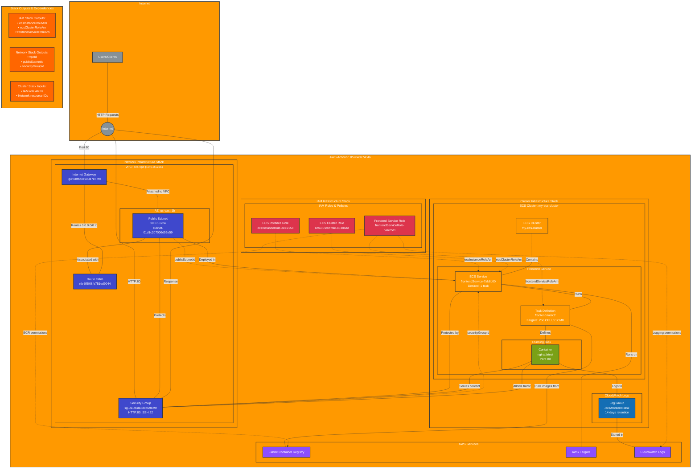

# Production Infrastructure Overview

This master diagram shows the complete production infrastructure across all Pulumi stacks, including cross-stack dependencies and data flow.

## Architecture Overview

### Stack Architecture
The production infrastructure is organized into three logical Pulumi stacks:

1. **IAM Infrastructure Stack** (`iam-infrastructure`)
   - Manages all IAM roles and policies
   - Provides role ARNs to dependent stacks
   - Follows principle of least privilege

2. **Network Infrastructure Stack** (`network-infrastructure`)
   - Manages VPC, subnets, routing, and security groups
   - Provides network resource IDs to dependent stacks
   - Establishes secure network boundaries

3. **Cluster Infrastructure Stack** (`cluster-infrastructure`)
   - Manages ECS cluster, services, and task definitions
   - Consumes outputs from IAM and Network stacks
   - Runs containerized applications

### Cross-Stack Dependencies

#### IAM → Cluster
- `ecsInstanceRoleArn`: For EC2 instances (if using EC2 launch type)
- `ecsClusterRoleArn`: For ECS cluster management operations
- `frontendServiceRoleArn`: For task execution and application permissions

#### Network → Cluster
- `vpcId`: VPC identifier for resource placement
- `publicSubnetId`: Subnet for task deployment
- `securityGroupId`: Security group for access control

### Data Flow Patterns

#### User Request Flow
1. **Client Request** → Internet → Internet Gateway
2. **Network Routing** → VPC → Public Subnet
3. **Security Filtering** → Security Group (allows HTTP:80)
4. **Container Processing** → Nginx container
5. **Response Path** → Reverse of request flow

#### Container Lifecycle Flow
1. **Image Pull** → ECR (via frontend service role)
2. **Task Launch** → Fargate platform
3. **Network Assignment** → Public subnet with auto-assign IP
4. **Log Streaming** → CloudWatch Logs group

#### Security & Permissions Flow
1. **Task Execution** → Frontend service role assumes permissions
2. **ECR Access** → Role allows image pulling
3. **Logging Access** → Role allows log stream creation and writing
4. **Network Security** → Security group controls traffic

### Resource Relationships

#### High-Level Architecture
- **Compute**: AWS Fargate (serverless containers)
- **Networking**: VPC with public subnet and internet gateway
- **Security**: IAM roles with least-privilege policies + security groups
- **Monitoring**: CloudWatch Logs with 14-day retention
- **Container Registry**: ECR for image storage

#### Scaling & Availability
- **Current Configuration**: Single AZ deployment (us-east-1b)
- **Service Scaling**: ECS service with desired count of 1
- **Container Platform**: Fargate (serverless, managed scaling)

### Infrastructure Characteristics

#### Security Posture
- ✅ IAM roles with specific, limited permissions
- ✅ Security groups with defined ingress/egress rules
- ⚠️ Public subnet with internet access (consider private subnet + ALB)
- ⚠️ SSH access allowed (port 22) - review necessity

#### Operational Considerations
- **Monitoring**: CloudWatch Logs integration
- **Deployment**: Fargate platform (no server management)
- **Networking**: Single AZ (consider multi-AZ for HA)
- **Storage**: Stateless containers (no persistent volumes)

## Repository Information
All infrastructure is managed through Infrastructure as Code using Pulumi:
- **Repository**: `github.com/lichtie/prod-infrastructure`
- **Organization**: `elisabeth-demo`
- **Environment**: `prod`