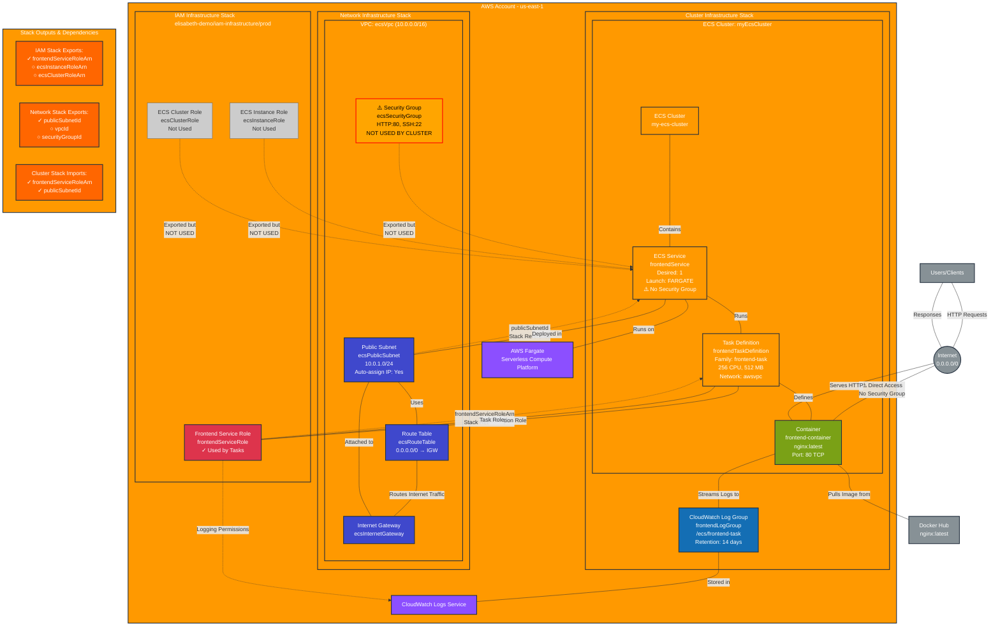

# Production Infrastructure Overview

This master diagram shows the complete production infrastructure across all Pulumi stacks, including cross-stack dependencies and data flow.

```mermaid
graph TB
    USERS[Users/Clients]
    INTERNET((Internet<br/>0.0.0.0/0))
    DOCKER_HUB[Docker Hub<br/>nginx:latest]

    subgraph "AWS Account - us-east-1"
        subgraph "IAM Infrastructure Stack<br/>elisabeth-demo/iam-infrastructure/prod"
            ECS_INST_ROLE[ECS Instance Role<br/>ecsInstanceRole<br/>Not Used]
            ECS_CLUSTER_ROLE[ECS Cluster Role<br/>ecsClusterRole<br/>Not Used]
            FRONTEND_ROLE[Frontend Service Role<br/>frontendServiceRole<br/>✓ Used by Tasks]
        end

        subgraph "Network Infrastructure Stack<br/>elisabeth-demo/network-infrastructure/prod"
            subgraph "VPC: ecsVpc (10.0.0.0/16)"
                IGW[Internet Gateway<br/>ecsInternetGateway]

                ROUTE_TABLE[Route Table<br/>ecsRouteTable<br/>0.0.0.0/0 → IGW]

                PUBLIC_SUBNET[Public Subnet<br/>ecsPublicSubnet<br/>10.0.1.0/24<br/>Auto-assign IP: Yes]

                SECURITY_GROUP[⚠️ Security Group<br/>ecsSecurityGroup<br/>HTTP:80, SSH:22<br/>NOT USED BY CLUSTER]
            end
        end

        subgraph "Cluster Infrastructure Stack<br/>elisabeth-demo/cluster-infrastructure/prod"
            subgraph "ECS Cluster: myEcsCluster"
                ECS_CLUSTER[ECS Cluster<br/>my-ecs-cluster]

                ECS_SERVICE[ECS Service<br/>frontendService<br/>Desired: 1<br/>Launch: FARGATE<br/>⚠️ No Security Group]

                TASK_DEF[Task Definition<br/>frontendTaskDefinition<br/>Family: frontend-task<br/>256 CPU, 512 MB<br/>Network: awsvpc]

                NGINX_CONTAINER[Container<br/>frontend-container<br/>nginx:latest<br/>Port: 80 TCP]
            end

            LOG_GROUP[CloudWatch Log Group<br/>frontendLogGroup<br/>/ecs/frontend-task<br/>Retention: 14 days]
        end

        FARGATE[AWS Fargate<br/>Serverless Compute Platform]
        CLOUDWATCH[CloudWatch Logs Service]
    end

    %% External Traffic Flow
    USERS ---|HTTP Requests| INTERNET
    INTERNET ---|⚠️ Direct Access<br/>No Security Group| NGINX_CONTAINER

    %% Network Infrastructure
    IGW ---|Attached to| PUBLIC_SUBNET
    ROUTE_TABLE ---|Routes Internet Traffic| IGW
    PUBLIC_SUBNET ---|Uses| ROUTE_TABLE
    SECURITY_GROUP -.->|Exported but<br/>NOT USED| ECS_SERVICE

    %% Cross-Stack Dependencies (Stack References)
    FRONTEND_ROLE -.->|frontendServiceRoleArn<br/>Stack Reference| TASK_DEF
    PUBLIC_SUBNET -.->|publicSubnetId<br/>Stack Reference| ECS_SERVICE

    %% Unused Exports
    ECS_INST_ROLE -.->|Exported but<br/>NOT USED| ECS_SERVICE
    ECS_CLUSTER_ROLE -.->|Exported but<br/>NOT USED| ECS_SERVICE

    %% ECS Relationships
    ECS_CLUSTER ---|Contains| ECS_SERVICE
    ECS_SERVICE ---|Runs| TASK_DEF
    TASK_DEF ---|Defines| NGINX_CONTAINER
    ECS_SERVICE ---|Deployed in| PUBLIC_SUBNET
    ECS_SERVICE ---|Runs on| FARGATE

    %% IAM Relationships
    TASK_DEF ---|Execution Role| FRONTEND_ROLE
    TASK_DEF ---|Task Role| FRONTEND_ROLE

    %% Service Integrations
    NGINX_CONTAINER ---|Pulls Image from| DOCKER_HUB
    NGINX_CONTAINER ---|Streams Logs to| LOG_GROUP
    LOG_GROUP ---|Stored in| CLOUDWATCH
    FRONTEND_ROLE -.->|Logging Permissions| CLOUDWATCH

    %% Data Flow
    NGINX_CONTAINER ---|Serves HTTP| INTERNET
    INTERNET ---|Responses| USERS

    %% Stack Outputs Summary
    subgraph "Stack Outputs & Dependencies"
        IAM_OUT[IAM Stack Exports:<br/>✓ frontendServiceRoleArn<br/>○ ecsInstanceRoleArn<br/>○ ecsClusterRoleArn]
        NET_OUT[Network Stack Exports:<br/>✓ publicSubnetId<br/>○ vpcId<br/>○ securityGroupId]
        CLUSTER_IN[Cluster Stack Imports:<br/>✓ frontendServiceRoleArn<br/>✓ publicSubnetId]
    end

    %% Styling
    classDef iam fill:#DD344C,stroke:#232F3E,stroke-width:2px,color:#fff
    classDef network fill:#3F48CC,stroke:#232F3E,stroke-width:2px,color:#fff
    classDef cluster fill:#FF9900,stroke:#232F3E,stroke-width:2px,color:#fff
    classDef container fill:#7AA116,stroke:#232F3E,stroke-width:2px,color:#fff
    classDef aws fill:#8C4FFF,stroke:#232F3E,stroke-width:2px,color:#fff
    classDef logs fill:#146EB4,stroke:#232F3E,stroke-width:2px,color:#fff
    classDef external fill:#879196,stroke:#232F3E,stroke-width:2px,color:#fff
    classDef outputs fill:#FF6600,stroke:#232F3E,stroke-width:2px,color:#fff
    classDef warning fill:#FFA500,stroke:#FF0000,stroke-width:2px,color:#000
    classDef unused fill:#CCCCCC,stroke:#666666,stroke-width:1px,color:#333

    class FRONTEND_ROLE iam
    class ECS_INST_ROLE,ECS_CLUSTER_ROLE unused
    class IGW,PUBLIC_SUBNET,ROUTE_TABLE network
    class SECURITY_GROUP warning
    class ECS_CLUSTER,ECS_SERVICE,TASK_DEF cluster
    class NGINX_CONTAINER container
    class FARGATE,CLOUDWATCH aws
    class LOG_GROUP logs
    class USERS,INTERNET,DOCKER_HUB external
    class IAM_OUT,NET_OUT,CLUSTER_IN outputs
```

## Architecture Overview

### Stack Architecture

The production infrastructure is organized into three logical Pulumi stacks:

1. **IAM Infrastructure Stack** (`iam-infrastructure`)
   - Project: `iam-infrastructure`
   - Stack: `prod`
   - Full name: `elisabeth-demo/iam-infrastructure/prod`
   - Manages all IAM roles and policies
   - **Exports**: `frontendServiceRoleArn` (✓ used), `ecsInstanceRoleArn` (○ unused), `ecsClusterRoleArn` (○ unused)

2. **Network Infrastructure Stack** (`network-infrastructure`)
   - Project: `network-infrastructure`
   - Stack: `prod`
   - Full name: `elisabeth-demo/network-infrastructure/prod`
   - Manages VPC, subnets, routing, and security groups
   - **Exports**: `publicSubnetId` (✓ used), `vpcId` (○ unused), `securityGroupId` (○ unused)

3. **Cluster Infrastructure Stack** (`cluster-infrastructure`)
   - Project: `cluster-infrastructure`
   - Stack: `prod`
   - Full name: `elisabeth-demo/cluster-infrastructure/prod`
   - Manages ECS cluster, services, and task definitions
   - **Imports**: `frontendServiceRoleArn`, `publicSubnetId`
   - Runs containerized applications on AWS Fargate

### Cross-Stack Dependencies

#### IAM → Cluster (Active)
- ✓ `frontendServiceRoleArn`: Used as both execution role and task role for ECS tasks
  - Provides permissions for pulling images, writing logs, and S3 access

#### IAM → Cluster (Unused Exports)
- ○ `ecsInstanceRoleArn`: Exported but not consumed (Fargate doesn't use EC2 instances)
- ○ `ecsClusterRoleArn`: Exported but not consumed (not required for Fargate)

#### Network → Cluster (Active)
- ✓ `publicSubnetId`: Subnet where ECS tasks are deployed with auto-assigned public IPs

#### Network → Cluster (Unused Exports)
- ○ `vpcId`: Exported but not consumed by cluster stack
- ○ `securityGroupId`: **⚠️ Exported but not consumed - Security Gap**
  - The security group is defined and exported but the ECS service uses an empty security group array
  - This leaves tasks exposed directly to the internet without network-level filtering

### Data Flow Patterns

#### User Request Flow

1. **Client Request** → Internet (0.0.0.0/0)
2. **⚠️ Direct Access** → Nginx container (no security group filtering)
3. **Container Processing** → Nginx serves content on port 80
4. **Response Path** → Back through internet to client

**Security Issue**: No security group is applied to the ECS service, so traffic reaches containers without network-level filtering.

#### Container Lifecycle Flow

1. **Image Pull** → Docker Hub (nginx:latest) via frontend service role
2. **Task Launch** → AWS Fargate serverless platform
3. **Network Assignment** → Public subnet with auto-assigned public IP
4. **Log Streaming** → CloudWatch Logs group (/ecs/frontend-task)

#### Security & Permissions Flow

1. **Task Execution** → Frontend service role provides execution permissions
2. **Image Pull** → Role allows pulling from Docker Hub (public images)
3. **Logging Access** → Role allows CloudWatch log stream creation and writing
4. **⚠️ Network Security** → No security group applied (empty array in code)

### Resource Relationships

#### High-Level Architecture

- **Compute**: AWS Fargate (serverless containers)
- **Networking**: VPC with public subnet and internet gateway
- **Security**: IAM roles with specific policies, ⚠️ security group defined but not used
- **Monitoring**: CloudWatch Logs with 14-day retention
- **Container Images**: Docker Hub (nginx:latest)

#### Scaling & Availability

- **Current Configuration**: Single subnet deployment (no specific AZ pinning)
- **Service Scaling**: ECS service with desired count of 1 task
- **Container Platform**: Fargate (serverless, AWS-managed infrastructure)
- **High Availability**: Not configured (single task, single subnet)

### Infrastructure Characteristics

#### Security Posture

- ✅ IAM roles with specific permissions for logging and image pulling
- ⚠️ **Critical**: Security group defined but NOT applied to ECS service
  - Code shows `securityGroups: []` (empty array)
  - Tasks are directly exposed to internet without network filtering
  - Security group exists with HTTP:80 and SSH:22 rules but is unused
- ⚠️ Public subnet with direct internet access (no ALB or security group protection)
- ⚠️ Single IAM role used for both execution and task permissions (not separated)

#### Operational Considerations

- **Monitoring**: CloudWatch Logs with 14-day retention
- **Deployment**: Fargate platform (fully managed, no server management)
- **Networking**: Single subnet (no multi-AZ redundancy)
- **Storage**: Stateless containers (no persistent volumes)
- **Image Source**: Public Docker Hub (nginx:latest)
- **Stack References**: Uses Pulumi StackReference for cross-stack dependencies

## Repository Information

All infrastructure is managed through Infrastructure as Code using Pulumi:

- **Repository**: `github.com/lichtie/prod-infrastructure`
- **Organization**: `elisabeth-demo`
- **Environment**: `prod`
- **Language**: TypeScript (Node.js runtime)
- **Projects**: 3 separate projects (iam, network, ecs-cluster directories)
- **Stacks**: Each project has a `prod` stack

## Recommendations

Based on the current infrastructure analysis, consider these improvements:

1. **Security Group Configuration** (High Priority)
   - Update `ecs-cluster/index.ts` line 74 to reference the security group from network stack
   - Change `securityGroups: []` to `securityGroups: [networkStack.getOutput("securityGroupId")]`

2. **IAM Role Separation** (Medium Priority)
   - Consider separating execution role from task role for better security isolation
   - Execution role: Only ECR and CloudWatch permissions
   - Task role: Application-specific permissions (S3, etc.)

3. **High Availability** (Medium Priority)
   - Deploy across multiple subnets in different availability zones
   - Increase desired task count for redundancy
   - Consider adding an Application Load Balancer

4. **Unused Resources** (Low Priority)
   - Remove or document why `ecsInstanceRole` and `ecsClusterRole` are exported but unused
   - These roles are for EC2 launch type, not needed for Fargate
