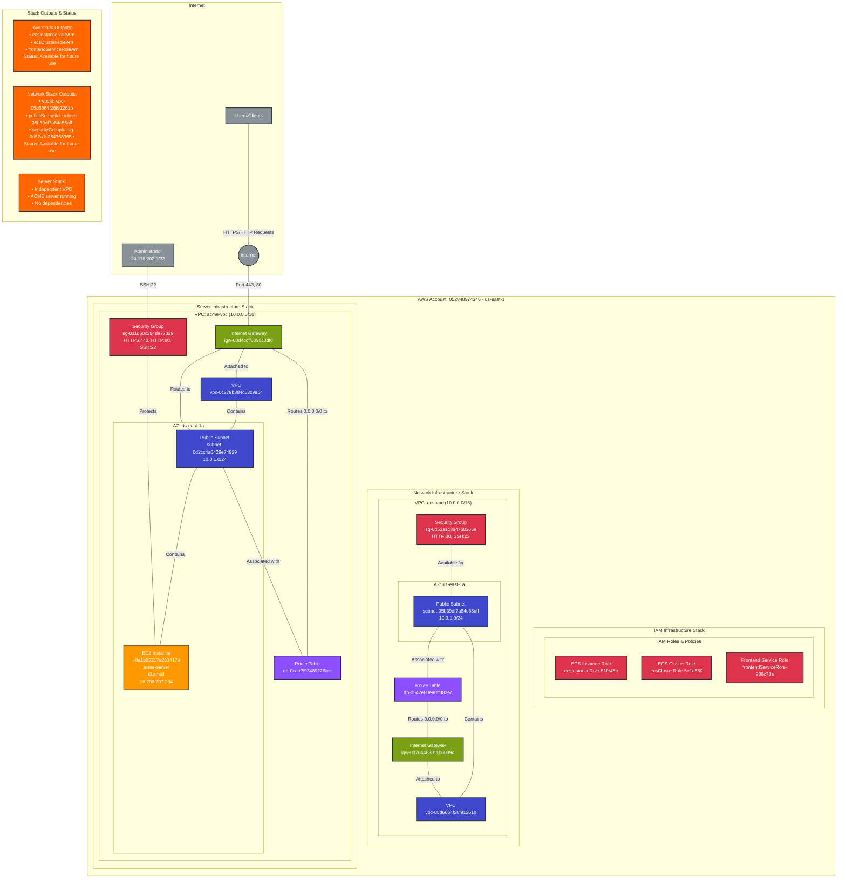

# Production Infrastructure Overview

This master diagram shows the complete production infrastructure across all Pulumi stacks, including cross-stack dependencies and data flow.

```mermaid
graph TB
    subgraph "Internet"
        USERS[Users/Clients]
        ADMIN[Administrator<br/>24.118.202.3/32]
        INTERNET((Internet))
    end

    subgraph "AWS Account: 052848974346 - us-east-1"
        subgraph "IAM Infrastructure Stack"
            subgraph "IAM Roles & Policies"
                ECS_INST_ROLE[ECS Instance Role<br/>ecsInstanceRole-51fe46e]
                ECS_CLUSTER_ROLE[ECS Cluster Role<br/>ecsClusterRole-5e1a580]
                FRONTEND_ROLE[Frontend Service Role<br/>frontendServiceRole-989c78a]
            end
        end

        subgraph "Network Infrastructure Stack"
            subgraph "VPC: ecs-vpc (10.0.0.0/16)"
                ECS_VPC[VPC<br/>vpc-05d6664f26f91261b]
                ECS_IGW[Internet Gateway<br/>igw-0376448381106889d]

                subgraph "AZ: us-east-1a"
                    ECS_SUBNET[Public Subnet<br/>subnet-05b39df7a84c55aff<br/>10.0.1.0/24]
                end

                ECS_RT[Route Table<br/>rtb-0542e80ea0ff882ec]
                ECS_SG[Security Group<br/>sg-0d52a1c384768365e<br/>HTTP:80, SSH:22]
            end
        end

        subgraph "Server Infrastructure Stack"
            subgraph "VPC: acme-vpc (10.0.0.0/16)"
                ACME_VPC[VPC<br/>vpc-0c279b384c53c9a54]
                ACME_IGW[Internet Gateway<br/>igw-00d4ccff6095c3df0]

                subgraph "AZ: us-east-1a"
                    ACME_SUBNET[Public Subnet<br/>subnet-0d2cc4a0428e74929<br/>10.0.1.0/24]
                    
                    ACME_SERVER[EC2 Instance<br/>i-0a1b95317e253417a<br/>acme-server<br/>t3.small<br/>18.208.207.234]
                end

                ACME_RT[Route Table<br/>rtb-0cabf593489226fee]
                ACME_SG[Security Group<br/>sg-011d50c294de77339<br/>HTTPS:443, HTTP:80, SSH:22]
            end
        end
    end

    %% External Traffic Flow - ACME Server
    USERS ---|HTTPS/HTTP Requests| INTERNET
    INTERNET ---|Port 443, 80| ACME_IGW
    ACME_IGW ---|Routes to| ACME_SUBNET
    ACME_SUBNET ---|Contains| ACME_SERVER
    ACME_SG ---|Protects| ACME_SERVER

    %% Admin Access - ACME Server
    ADMIN ---|SSH:22| ACME_SG

    %% Network Infrastructure (ECS VPC - Available but Unused)
    ECS_IGW ---|Attached to| ECS_VPC
    ECS_VPC ---|Contains| ECS_SUBNET
    ECS_RT ---|Routes 0.0.0.0/0 to| ECS_IGW
    ECS_SUBNET ---|Associated with| ECS_RT
    ECS_SG ---|Available for| ECS_SUBNET

    %% ACME Server Network
    ACME_IGW ---|Attached to| ACME_VPC
    ACME_VPC ---|Contains| ACME_SUBNET
    ACME_RT ---|Routes 0.0.0.0/0 to| ACME_IGW
    ACME_SUBNET ---|Associated with| ACME_RT

    %% Stack Boundaries
    subgraph "Stack Outputs & Status"
        IAM_OUTPUTS[IAM Stack Outputs:<br/>• ecsInstanceRoleArn<br/>• ecsClusterRoleArn<br/>• frontendServiceRoleArn<br/>Status: Available for future use]
        NET_OUTPUTS[Network Stack Outputs:<br/>• vpcId: vpc-05d6664f26f91261b<br/>• publicSubnetId: subnet-05b39df7a84c55aff<br/>• securityGroupId: sg-0d52a1c384768365e<br/>Status: Available for future use]
        SERVER_STATUS[Server Stack:<br/>• Independent VPC<br/>• ACME server running<br/>• No dependencies]
    end

    %% Styling
    classDef iam fill:#DD344C,stroke:#232F3E,stroke-width:2px,color:#fff
    classDef network fill:#3F48CC,stroke:#232F3E,stroke-width:2px,color:#fff
    classDef compute fill:#FF9900,stroke:#232F3E,stroke-width:2px,color:#fff
    classDef security fill:#DD344C,stroke:#232F3E,stroke-width:2px,color:#fff
    classDef external fill:#879196,stroke:#232F3E,stroke-width:2px,color:#fff
    classDef outputs fill:#FF6600,stroke:#232F3E,stroke-width:2px,color:#fff
    classDef gateway fill:#7AA116,stroke:#232F3E,stroke-width:2px,color:#fff
    classDef routing fill:#8C4FFF,stroke:#232F3E,stroke-width:2px,color:#fff

    class ECS_INST_ROLE,ECS_CLUSTER_ROLE,FRONTEND_ROLE iam
    class ECS_VPC,ECS_SUBNET,ACME_VPC,ACME_SUBNET network
    class ACME_SERVER compute
    class ECS_SG,ACME_SG security
    class ECS_IGW,ACME_IGW gateway
    class ECS_RT,ACME_RT routing
    class USERS,ADMIN,INTERNET external
    class IAM_OUTPUTS,NET_OUTPUTS,SERVER_STATUS outputs
```

## Architecture Overview

### Stack Architecture

The production infrastructure is organized into three independent Pulumi stacks:

1. **IAM Infrastructure Stack** (`iam-infrastructure/iaminfra`)

   - Manages IAM roles and policies for ECS operations
   - Exports role ARNs for use by other stacks
   - Follows principle of least privilege
   - **Status**: Available but currently unused (no active ECS cluster)

2. **Network Infrastructure Stack** (`network-infrastructure/networkstack`)

   - Manages VPC, subnets, routing, and security groups for ECS
   - Exports network resource IDs for use by other stacks
   - Establishes secure network boundaries
   - **Status**: Available but currently unused (no active ECS cluster)

3. **Server Infrastructure Stack** (`server-infra/prod`)
   - Manages ACME server infrastructure in dedicated VPC
   - Self-contained with own networking resources
   - Runs EC2 instance for certificate management
   - **Status**: Active and running

### Stack Independence

**Important**: The three stacks are currently **independent** with no active cross-stack dependencies:

- **IAM Stack**: Exports ECS-related IAM roles, but no stack currently consumes them
- **Network Stack**: Exports VPC and networking resources, but no stack currently consumes them
- **Server Stack**: Operates in its own isolated VPC with no dependencies on other stacks

The IAM and Network stacks were originally created to support an ECS cluster deployment, but that cluster stack is no longer active. These resources remain available for future ECS deployments.

### Data Flow Patterns

#### ACME Server Request Flow (Active)

1. **Client Request** → Internet → ACME VPC Internet Gateway
2. **Network Routing** → ACME VPC → Public Subnet (10.0.1.0/24)
3. **Security Filtering** → Security Group (allows HTTPS:443, HTTP:80)
4. **Server Processing** → EC2 instance processes ACME protocol requests
5. **Response Path** → Reverse of request flow

#### Administrative Access Flow (Active)

1. **Admin Connection** → SSH from specific IP (24.118.202.3/32)
2. **Security Filtering** → Security Group (allows SSH:22 from specific IP only)
3. **Server Access** → EC2 instance management

### Resource Relationships

#### Active Infrastructure

- **Compute**: EC2 t3.small instance running ACME server
- **Networking**: Dedicated VPC (10.0.0.0/16) with public subnet and internet gateway
- **Security**: Security group with restricted SSH access and open HTTPS/HTTP for ACME protocol
- **Region**: us-east-1, Availability Zone: us-east-1a

#### Available Infrastructure (Unused)

- **IAM**: Three ECS-related IAM roles ready for future ECS deployments
- **Networking**: VPC (10.0.0.0/16) with public subnet ready for future ECS deployments

### Infrastructure Characteristics

#### Security Posture

**ACME Server Stack:**
- ✅ SSH access restricted to specific IP address (24.118.202.3/32)
- ✅ Dedicated VPC isolates ACME server from other infrastructure
- ✅ Security group with defined ingress rules
- ⚠️ Public subnet with internet access (required for ACME protocol)
- ⚠️ HTTP port 80 open (required for ACME HTTP-01 challenges)

**IAM & Network Stacks:**
- ✅ IAM roles with specific, limited permissions
- ✅ Security groups with defined ingress/egress rules
- ℹ️ Resources available but currently unused

#### Operational Considerations

**Active Infrastructure:**
- **ACME Server**: Single EC2 instance, manual management required
- **Monitoring**: Basic CloudWatch metrics
- **Availability**: Single AZ deployment (consider multi-AZ for HA)
- **Maintenance**: Manual updates and patching required

**Available Infrastructure:**
- **IAM Roles**: Ready for ECS deployments
- **Network Resources**: Ready for ECS or other compute deployments

## Repository Information

Infrastructure is managed through Infrastructure as Code using Pulumi:

- **IAM & Network Stacks**: `github.com/lichtie/prod-infrastructure`
- **Server Stack**: No repository URL configured
- **Organization**: `elisabeth-demo`
- **Environment**: `prod`
- **Region**: us-east-1
