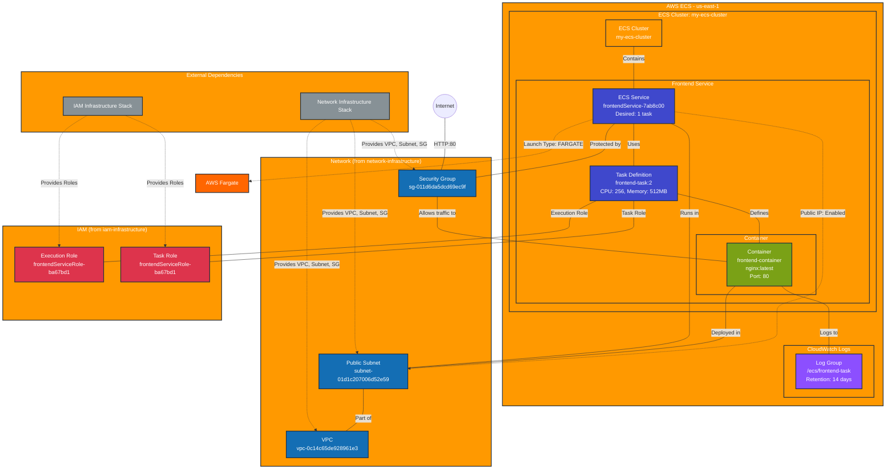

# Cluster Infrastructure Stack - Production

This diagram shows the ECS cluster and containerized applications deployed in the `cluster-infrastructure` prod stack.

## Resources Summary

### ECS Resources
- **Cluster**: `my-ecs-cluster`
- **Service**: `frontendService-7ab8c00`
  - Desired Count: 1 task
  - Launch Type: AWS Fargate
  - Platform Version: LATEST
- **Task Definition**: `frontend-task:2`
  - CPU: 256 units
  - Memory: 512 MB
  - Network Mode: awsvpc
  - Requires Compatibility: FARGATE

### Container Configuration
- **Container Name**: `frontend-container`
- **Image**: `nginx:latest`
- **Port Mapping**: Container port 80 → Host port 80
- **Protocol**: TCP
- **Essential**: Yes

### Logging Configuration
- **Log Group**: `/ecs/frontend-task`
- **Log Driver**: awslogs
- **Region**: us-east-1
- **Stream Prefix**: ecs
- **Retention**: 14 days

### Network Configuration
- **VPC**: Inherited from network-infrastructure stack
- **Subnet**: Public subnet with auto-assign public IP enabled
- **Security Group**: Allows HTTP (80) and SSH (22) from internet

### IAM Configuration
- **Execution Role**: `frontendServiceRole-ba67bd1` (for pulling images, logging)
- **Task Role**: `frontendServiceRole-ba67bd1` (for application permissions)

## Stack Dependencies

### Consumes from network-infrastructure
- `vpcId`: VPC identifier for network placement
- `publicSubnetId`: Subnet for task deployment
- `securityGroupId`: Security group for network access control

### Consumes from iam-infrastructure
- `frontendServiceRoleArn`: IAM role for task execution and application permissions
- `ecsClusterRoleArn`: IAM role for cluster operations
- `ecsInstanceRoleArn`: IAM role for EC2 instances (if using EC2 launch type)

## Data Flow
1. **Internet Traffic** → Security Group (port 80) → Frontend Container
2. **Container Logs** → CloudWatch Logs (`/ecs/frontend-task`)
3. **Image Pull** → ECR (via execution role permissions)
4. **Task Networking** → Public subnet with internet gateway access