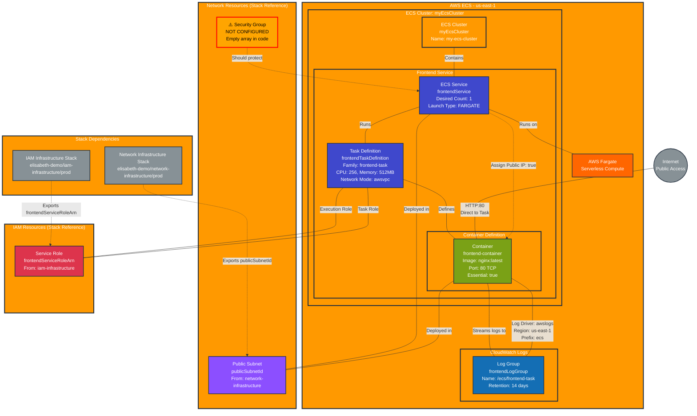

# Cluster Infrastructure Stack - Production

This diagram shows the ECS cluster and containerized applications deployed in the `cluster-infrastructure` prod stack.

```mermaid
graph TB
    INTERNET((Internet<br/>Public Access))

    subgraph "Stack Dependencies"
        IAM_STACK[IAM Infrastructure Stack<br/>elisabeth-demo/iam-infrastructure/prod]
        NET_STACK[Network Infrastructure Stack<br/>elisabeth-demo/network-infrastructure/prod]
    end
    
    subgraph "AWS ECS - us-east-1"
        subgraph "ECS Cluster: myEcsCluster"
            CLUSTER[ECS Cluster<br/>myEcsCluster<br/>Name: my-ecs-cluster]
            
            subgraph "Frontend Service"
                SERVICE[ECS Service<br/>frontendService<br/>Desired Count: 1<br/>Launch Type: FARGATE]
                
                TASK_DEF[Task Definition<br/>frontendTaskDefinition<br/>Family: frontend-task<br/>CPU: 256, Memory: 512MB<br/>Network Mode: awsvpc]
                
                subgraph "Container Definition"
                    CONTAINER[Container<br/>frontend-container<br/>Image: nginx:latest<br/>Port: 80 TCP<br/>Essential: true]
                end
            end
        end
        
        subgraph "CloudWatch Logs"
            LOG_GROUP[Log Group<br/>frontendLogGroup<br/>Name: /ecs/frontend-task<br/>Retention: 14 days]
        end

        AWS_FARGATE[AWS Fargate<br/>Serverless Compute]
    end
    
    subgraph "Network Resources (Stack Reference)"
        SUBNET_REF[Public Subnet<br/>publicSubnetId<br/>From: network-infrastructure]
        SG_NOTE[⚠️ Security Group<br/>NOT CONFIGURED<br/>Empty array in code]
    end
    
    subgraph "IAM Resources (Stack Reference)"
        SERVICE_ROLE[Service Role<br/>frontendServiceRoleArn<br/>From: iam-infrastructure]
    end
    
    %% Stack References
    NET_STACK -.->|Exports publicSubnetId| SUBNET_REF
    IAM_STACK -.->|Exports frontendServiceRoleArn| SERVICE_ROLE
    
    %% ECS Relationships
    CLUSTER ---|Contains| SERVICE
    SERVICE ---|Runs| TASK_DEF
    TASK_DEF ---|Defines| CONTAINER
    SERVICE ---|Deployed in| SUBNET_REF
    SERVICE ---|Runs on| AWS_FARGATE
    
    %% IAM Relationships
    TASK_DEF ---|Execution Role| SERVICE_ROLE
    TASK_DEF ---|Task Role| SERVICE_ROLE
    
    %% Logging
    CONTAINER ---|Streams logs to| LOG_GROUP
    LOG_GROUP ---|Log Driver: awslogs<br/>Region: us-east-1<br/>Prefix: ecs| CONTAINER
    
    %% Network Flow
    INTERNET ---|HTTP:80<br/>Direct to Task| CONTAINER
    CONTAINER ---|Deployed in| SUBNET_REF
    SERVICE -.->|Assign Public IP: true| CONTAINER
    
    %% Security Warning
    SG_NOTE -.->|Should protect| SERVICE
    
    %% Styling
    classDef cluster fill:#FF9900,stroke:#232F3E,stroke-width:3px,color:#fff
    classDef service fill:#3F48CC,stroke:#232F3E,stroke-width:2px,color:#fff
    classDef container fill:#7AA116,stroke:#232F3E,stroke-width:2px,color:#fff
    classDef logs fill:#146EB4,stroke:#232F3E,stroke-width:2px,color:#fff
    classDef network fill:#8C4FFF,stroke:#232F3E,stroke-width:2px,color:#fff
    classDef iam fill:#DD344C,stroke:#232F3E,stroke-width:2px,color:#fff
    classDef stack fill:#879196,stroke:#232F3E,stroke-width:2px,color:#fff
    classDef fargate fill:#FF6600,stroke:#232F3E,stroke-width:2px,color:#fff
    classDef warning fill:#FFA500,stroke:#FF0000,stroke-width:3px,color:#000
    classDef external fill:#879196,stroke:#232F3E,stroke-width:2px,color:#fff
    
    class CLUSTER cluster
    class SERVICE,TASK_DEF service
    class CONTAINER container
    class LOG_GROUP logs
    class SUBNET_REF network
    class SERVICE_ROLE iam
    class IAM_STACK,NET_STACK stack
    class AWS_FARGATE fargate
    class SG_NOTE warning
    class INTERNET external
```

## Resources Summary

### ECS Resources
- **Cluster**: `myEcsCluster`
  - Cluster Name: `my-ecs-cluster`
- **Service**: `frontendService`
  - Desired Count: 1 task
  - Launch Type: AWS Fargate
  - Assign Public IP: Enabled
  - **⚠️ Security Groups**: Empty array (no security group configured)
- **Task Definition**: `frontendTaskDefinition`
  - Family: `frontend-task`
  - CPU: 256 units
  - Memory: 512 MB
  - Network Mode: awsvpc
  - Requires Compatibility: FARGATE

### Container Configuration
- **Container Name**: `frontend-container`
- **Image**: `nginx:latest`
- **Port Mapping**: Container port 80 → Host port 80
- **Protocol**: TCP
- **Essential**: Yes

### Logging Configuration
- **Log Group**: `/ecs/frontend-task`
- **Log Driver**: awslogs
- **Region**: us-east-1
- **Stream Prefix**: ecs
- **Retention**: 14 days

### Network Configuration
- **Subnet**: Public subnet from network-infrastructure stack (`publicSubnetId`)
  - Auto-assign public IP enabled at service level
- **⚠️ Security Group**: NOT CONFIGURED
  - Code shows `securityGroups: []` (empty array)
  - Tasks are exposed directly to internet without security group protection
  - **Security Risk**: No network-level access control

### IAM Configuration
- **Execution Role**: `frontendServiceRoleArn` from iam-infrastructure stack
  - Used for pulling container images from ECR
  - Used for writing logs to CloudWatch
- **Task Role**: `frontendServiceRoleArn` from iam-infrastructure stack
  - Same role used for both execution and task permissions
  - Provides application-level AWS API access

## Stack Dependencies

### Consumes from network-infrastructure
- `publicSubnetId`: Subnet for task deployment
- **Note**: `vpcId` and `securityGroupId` are exported by network-infrastructure but NOT consumed by this stack

### Consumes from iam-infrastructure
- `frontendServiceRoleArn`: IAM role for task execution and application permissions
- **Note**: `ecsClusterRoleArn` and `ecsInstanceRoleArn` are exported by iam-infrastructure but NOT consumed by this stack (Fargate launch type doesn't require them)

## Data Flow
1. **Internet Traffic** → ⚠️ Direct to Frontend Container (no security group filtering)
2. **Container Logs** → CloudWatch Logs (`/ecs/frontend-task`) via awslogs driver
3. **Image Pull** → Docker Hub (nginx:latest) via execution role permissions
4. **Task Networking** → Public subnet with auto-assigned public IP and internet gateway access

## Security Considerations
⚠️ **Critical Issue**: The ECS service is configured with an empty security group array (`securityGroups: []`), meaning tasks have no network-level access control. This exposes the containers directly to the internet without filtering. The network-infrastructure stack exports a security group, but it's not being used.