# Cluster Stack Architecture

## Overview
The Cluster stack provides the ECS compute infrastructure for running containerized applications. It creates an ECS cluster, task definitions, and services that utilize the networking and IAM resources from other stacks.

## Resources
Key resources deployed by this stack:
- **myEcsCluster**: ECS cluster for container orchestration
- **frontendTaskDefinition**: Task definition for frontend application
- **frontendService**: ECS service running the frontend
- **frontendLogGroup**: CloudWatch log group for application logs

## Dependencies
- **Stack References**:
  - `elisabeth-demo/prod/iam` - IAM roles for task execution
  - `elisabeth-demo/prod/network` - VPC, subnet, and security group
- **External Dependencies**: AWS ECS, CloudWatch Logs, ECR

## Architecture Diagram

```mermaid
graph TB
    %% Define AWS service icon styles
    classDef awsCompute fill:#FF9900,stroke:#232F3E,stroke-width:2px,color:#fff
    classDef awsMonitoring fill:#FF9900,stroke:#232F3E,stroke-width:2px,color:#fff
    classDef awsStorage fill:#FF9900,stroke:#232F3E,stroke-width:2px,color:#fff
    classDef stackref fill:#9C27B0,stroke:#6A1B9A,stroke-width:2px,color:#fff
    classDef container fill:#66BB6A,stroke:#388E3C,stroke-width:2px,color:#fff

    subgraph "Stack: cluster"
        subgraph "🐳 ECS Infrastructure"
            CLUSTER["🏗️ myEcsCluster<br/>ECS Cluster<br/>Container Insights: Disabled"]:::awsCompute

            subgraph "🚀 Frontend Application"
                TASKDEF["📦 frontendTaskDefinition<br/>Task Definition<br/>CPU: 256, Memory: 512MB<br/>Network: awsvpc, Fargate"]:::awsCompute
                SERVICE["⚙️ frontendService<br/>ECS Service<br/>Desired Count: 1<br/>Launch Type: Fargate"]:::awsCompute
                CONTAINER["🐋 nginx:latest<br/>Container<br/>Port: 80<br/>Essential: true"]:::container
            end

            subgraph "📊 Logging"
                LOGS["📝 frontendLogGroup<br/>CloudWatch Logs<br/>/ecs/frontend-task"]:::awsMonitoring
            end
        end

        subgraph "📋 Stack References"
            IAM_REF["🔗 elisabeth-demo/prod/iam<br/>StackReference<br/>IAM Roles"]:::stackref
            NET_REF["🔗 elisabeth-demo/prod/network<br/>StackReference<br/>VPC Resources"]:::stackref
        end
    end

    subgraph "🔗 Referenced Resources"
        subgraph "🔐 From IAM Stack"
            EXEC_ROLE["🔑 frontendServiceRole<br/>Execution Role<br/>ECR + Logs + S3"]:::stackref
            TASK_ROLE["🔑 frontendServiceRole<br/>Task Role<br/>Application Permissions"]:::stackref
        end

        subgraph "🌐 From Network Stack"
            VPC_ID["🏢 VPC<br/>vpc-0ea7b78d4210906cb<br/>10.0.0.0/16"]:::stackref
            SUBNET_ID["🌍 Public Subnet<br/>subnet-0046bb4d3bf6e9037<br/>Auto-assign Public IP"]:::stackref
            SG_ID["🔒 Security Group<br/>sg-0e2a00886b2bad3b2<br/>ECS Rules"]:::stackref
        end
    end

    subgraph "🌐 External Services"
        ECR["📦 Amazon ECR<br/>Container Registry<br/>nginx:latest"]:::awsStorage
        CW["📊 CloudWatch<br/>Monitoring & Logs"]:::awsMonitoring
    end

    %% Cluster relationships
    CLUSTER --> SERVICE
    SERVICE --> TASKDEF
    TASKDEF --> CONTAINER
    TASKDEF --> LOGS

    %% Stack reference relationships
    IAM_REF -.-> EXEC_ROLE
    IAM_REF -.-> TASK_ROLE
    NET_REF -.-> VPC_ID
    NET_REF -.-> SUBNET_ID
    NET_REF -.-> SG_ID

    %% Task execution relationships
    TASKDEF --> EXEC_ROLE
    TASKDEF --> TASK_ROLE
    SERVICE --> SUBNET_ID
    SERVICE --> SG_ID

    %% External service relationships
    CONTAINER --> ECR
    LOGS --> CW
```

## Configuration
Key configuration values used by this stack:
- **AWS Region**: us-east-1
- **AWS Provider Version**: 6.13.3
- **Launch Type**: Fargate (serverless)
- **Container Image**: nginx:latest
- **Task CPU**: 256 units
- **Task Memory**: 512 MB

## Stack References
This stack demonstrates cross-stack dependencies:

### IAM Stack Outputs Used
- **ecsClusterRoleArn**: `arn:aws:iam::052848974346:role/ecsClusterRole-00ff09e`
- **frontendServiceRoleArn**: `arn:aws:iam::052848974346:role/frontendServiceRole-cff32c6`
- **ecsInstanceRoleArn**: `arn:aws:iam::052848974346:role/ecsInstanceRole-6e8682c`

### Network Stack Outputs Used
- **vpcId**: `vpc-0ea7b78d4210906cb`
- **publicSubnetId**: `subnet-0046bb4d3bf6e9037`
- **securityGroupId**: `sg-0e2a00886b2bad3b2`

## Service Configuration

### Frontend Task Definition
- **Family**: frontend-task
- **Network Mode**: awsvpc (required for Fargate)
- **Requires Compatibilities**: FARGATE
- **Execution Role**: References IAM stack output
- **Task Role**: References IAM stack output

### Frontend Service
- **Cluster**: my-ecs-cluster
- **Launch Type**: FARGATE
- **Desired Count**: 1
- **Platform Version**: LATEST
- **Network Configuration**:
  - Subnets: Public subnet from network stack
  - Security Groups: From network stack
  - Assign Public IP: True

### Container Definition
- **Image**: nginx:latest
- **Port Mappings**: 80:80
- **Log Configuration**: CloudWatch Logs
- **Essential**: true

## Outputs
Key outputs that other stacks might reference:
- **clusterArn**: ECS cluster ARN
- **serviceArn**: Frontend service ARN
- **taskDefinitionArn**: Task definition ARN

## Notes
This stack demonstrates a complete ECS Fargate deployment with:
- Cross-stack resource sharing via StackReferences
- Proper IAM role separation for security
- CloudWatch logging integration
- Public internet connectivity for the frontend service
- Serverless container execution with Fargate