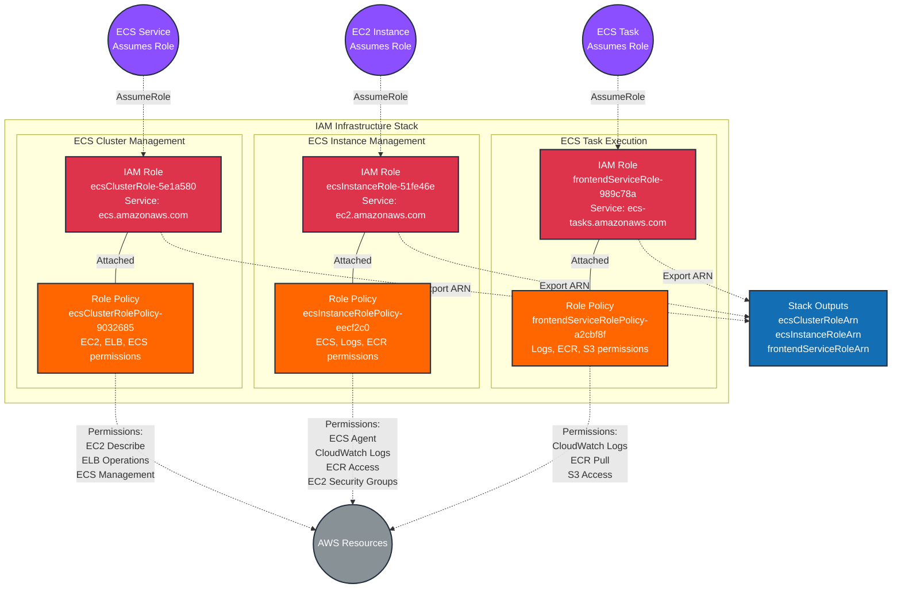

# IAM Infrastructure Stack - iaminfra

This diagram shows the IAM roles and policies deployed in the `iam-infrastructure` iaminfra stack.



## Resources Summary

### IAM Roles

#### 1. ECS Cluster Role

- **Role Name**: `ecsClusterRole-5e1a580`
- **ARN**: `arn:aws:iam::052848974346:role/ecsClusterRole-5e1a580`
- **Unique ID**: AROAQYTQLLIFHKZZZZKA5
- **Created**: 2025-12-22T15:49:08Z
- **Trust Policy**: Allows `ecs.amazonaws.com` to assume this role
- **Purpose**: Service role for ECS cluster management operations

**Attached Policy**: `ecsClusterRolePolicy-9032685`
- EC2 describe operations
- Elastic Load Balancing operations (register/deregister targets, describe health)
- ECS cluster, service, and task management

#### 2. ECS Instance Role

- **Role Name**: `ecsInstanceRole-51fe46e`
- **ARN**: `arn:aws:iam::052848974346:role/ecsInstanceRole-51fe46e`
- **Unique ID**: AROAQYTQLLIFHQR5ZAQQD
- **Created**: 2025-12-22T15:49:08Z
- **Trust Policy**: Allows `ec2.amazonaws.com` to assume this role
- **Purpose**: Instance role for EC2 instances running ECS container agent

**Attached Policy**: `ecsInstanceRolePolicy-eecf2c0`
- ECS cluster operations (create, register, poll, submit telemetry)
- CloudWatch Logs (create streams, put events)
- ECR access (authorization, layer downloads, image pulls)
- EC2 security group authorization

#### 3. Frontend Service Role

- **Role Name**: `frontendServiceRole-989c78a`
- **ARN**: `arn:aws:iam::052848974346:role/frontendServiceRole-989c78a`
- **Unique ID**: AROAQYTQLLIFGGJ36LKLT
- **Created**: 2025-12-22T15:49:08Z
- **Trust Policy**: Allows `ecs-tasks.amazonaws.com` to assume this role
- **Purpose**: Task execution role for ECS Fargate tasks

**Attached Policy**: `frontendServiceRolePolicy-a2cbf8f`
- CloudWatch Logs (create streams, put events)
- ECR access (authorization, layer downloads, image pulls)
- S3 operations (get/put objects)

## Policy Details

### ECS Cluster Role Policy

```json
{
  "Version": "2012-10-17",
  "Statement": [
    {
      "Action": [
        "ec2:Describe*",
        "elasticloadbalancing:Describe*",
        "elasticloadbalancing:RegisterTargets",
        "elasticloadbalancing:DeregisterTargets",
        "elasticloadbalancing:DescribeTargetHealth",
        "elasticloadbalancing:DescribeListeners",
        "ecs:ListClusters",
        "ecs:ListServices",
        "ecs:ListTasks",
        "ecs:Describe*"
      ],
      "Effect": "Allow",
      "Resource": "*"
    }
  ]
}
```

### ECS Instance Role Policy

```json
{
  "Version": "2012-10-17",
  "Statement": [
    {
      "Action": [
        "ecs:CreateCluster",
        "ecs:DeregisterContainerInstance",
        "ecs:DiscoverPollEndpoint",
        "ecs:Poll",
        "ecs:RegisterContainerInstance",
        "ecs:StartTelemetrySession",
        "ecs:Submit*",
        "logs:CreateLogStream",
        "logs:PutLogEvents",
        "ecr:GetAuthorizationToken",
        "ecr:BatchCheckLayerAvailability",
        "ecr:GetDownloadUrlForLayer",
        "ecr:BatchGetImage",
        "ec2:AuthorizeSecurityGroupIngress"
      ],
      "Effect": "Allow",
      "Resource": "*"
    }
  ]
}
```

### Frontend Service Role Policy

```json
{
  "Version": "2012-10-17",
  "Statement": [
    {
      "Action": [
        "logs:CreateLogStream",
        "logs:PutLogEvents",
        "ecr:GetDownloadUrlForLayer",
        "ecr:BatchCheckLayerAvailability",
        "ecr:GetAuthorizationToken",
        "ecr:BatchGetImage",
        "s3:GetObject",
        "s3:PutObject"
      ],
      "Effect": "Allow",
      "Resource": "*"
    }
  ]
}
```

## Stack Exports

This stack exports the following role ARNs for use by other stacks:

- **ecsClusterRoleArn**: `arn:aws:iam::052848974346:role/ecsClusterRole-5e1a580`
- **ecsInstanceRoleArn**: `arn:aws:iam::052848974346:role/ecsInstanceRole-51fe46e`
- **frontendServiceRoleArn**: `arn:aws:iam::052848974346:role/frontendServiceRole-989c78a`

## Architecture Overview

This stack provides the IAM foundation for ECS-based container workloads. It creates three distinct roles following the principle of least privilege:

### Role Purposes

1. **ECS Cluster Role**: Enables ECS service to manage cluster resources, load balancers, and service discovery
2. **ECS Instance Role**: Enables EC2 instances to join ECS clusters and run container agents
3. **Frontend Service Role**: Enables ECS tasks to access logging, container images, and application data

### Security Design

- **Separate Roles**: Each component (cluster, instance, task) has its own role with specific permissions
- **Service-Specific Trust**: Each role trusts only the appropriate AWS service
- **Least Privilege**: Policies grant only the permissions needed for each role's function
- **No Managed Policies**: Uses inline policies for explicit permission control

## Dependencies

### Consumed By

- **ecs-cluster stack** (when deployed): References `frontendServiceRoleArn` for task execution
- **Future ECS services**: Can reference any of the three role ARNs as needed

### Depends On

- None - This is a foundational stack with no dependencies

## Repository

- **Source**: github.com/lichtie/prod-infrastructure
- **Directory**: `/iam`
- **Language**: TypeScript
- **Provider**: AWS (version 7.6.0)

## Security Considerations

### Strengths

- ✅ **Separate Roles**: Clear separation of concerns between cluster, instance, and task roles
- ✅ **Service Trust**: Each role trusts only the appropriate AWS service
- ✅ **Explicit Policies**: Inline policies provide clear visibility into permissions

### Considerations

- ⚠️ **Wildcard Resources**: All policies use `"Resource": "*"` which grants permissions across all resources
- **Recommendation**: Consider restricting resources to specific ARNs where possible (e.g., specific S3 buckets, log groups)
- ⚠️ **Broad Permissions**: Some permissions like `ec2:Describe*` and `ecs:Describe*` are very broad
- **Recommendation**: Evaluate if all describe permissions are necessary

### Best Practices Applied

- ✅ **No Long-Term Credentials**: Roles use temporary credentials via AssumeRole
- ✅ **Service-Linked**: Roles are assumed by AWS services, not users
- ✅ **Version Control**: IAM policies are defined in code and version controlled

## Operational Considerations

### Role Usage

- **ECS Cluster Role**: Used by ECS service for cluster-level operations
- **ECS Instance Role**: Attached to EC2 instances running ECS agent (for EC2 launch type)
- **Frontend Service Role**: Used as both execution role and task role for Fargate tasks

### Monitoring

- **CloudTrail**: All AssumeRole operations are logged in CloudTrail
- **IAM Access Analyzer**: Can be used to analyze external access and unused permissions
- **Recommendation**: Enable CloudWatch Logs for IAM policy evaluation

### Maintenance

- **Policy Updates**: Modify inline policies as application requirements change
- **Role Rotation**: Consider periodic review of permissions and removal of unused permissions
- **Compliance**: Regular audits to ensure policies align with security requirements
