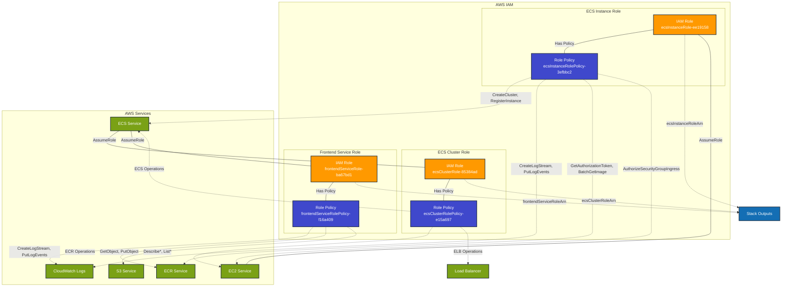

# IAM Infrastructure Stack - Production

This diagram shows the IAM roles and policies deployed in the `iam-infrastructure` prod stack.

## Resources Summary

### IAM Roles
- **ECS Instance Role**: `ecsInstanceRole-ee19158`
  - Trust: EC2 service
  - Purpose: EC2 instances running ECS agent
  
- **ECS Cluster Role**: `ecsClusterRole-85384ad`
  - Trust: ECS service
  - Purpose: ECS cluster management operations
  
- **Frontend Service Role**: `frontendServiceRole-ba67bd1`
  - Trust: ECS service
  - Purpose: Frontend task execution and logging

### IAM Policies

#### ECS Instance Role Policy
- **ECS Operations**: CreateCluster, DeregisterContainerInstance, DiscoverPollEndpoint, Poll, RegisterContainerInstance, StartTelemetrySession, Submit*
- **Logging**: CreateLogStream, PutLogEvents
- **ECR Access**: GetAuthorizationToken, BatchCheckLayerAvailability, GetDownloadUrlForLayer, BatchGetImage
- **EC2 Operations**: AuthorizeSecurityGroupIngress

#### ECS Cluster Role Policy
- **EC2 Operations**: Describe*
- **ELB Operations**: Describe*, RegisterTargets, DeregisterTargets, DescribeTargetHealth, DescribeListeners
- **ECS Operations**: ListClusters, ListServices, ListTasks, Describe*

#### Frontend Service Role Policy
- **Logging**: CreateLogStream, PutLogEvents
- **ECR Access**: GetDownloadUrlForLayer, BatchCheckLayerAvailability, GetAuthorizationToken, BatchGetImage
- **S3 Access**: GetObject, PutObject

### Stack Exports
This stack exports the following role ARNs for use by other stacks:
- `ecsInstanceRoleArn`: For EC2 instances
- `ecsClusterRoleArn`: For ECS cluster operations
- `frontendServiceRoleArn`: For frontend task execution

## Dependencies
- **Consumed by**: `cluster-infrastructure` stack (for ECS services and tasks)