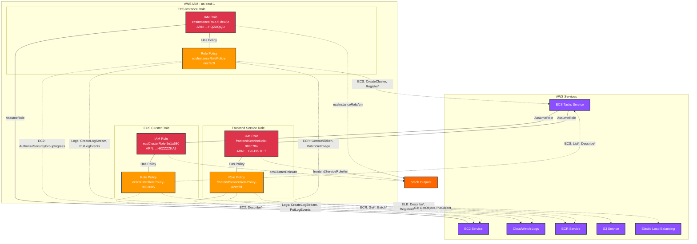

# IAM Infrastructure Stack - Production

This diagram shows the IAM roles and policies deployed in the `iam-infrastructure` prod stack.

```mermaid
graph TB
    subgraph "AWS IAM - us-east-1"
        subgraph "ECS Instance Role"
            EIR[IAM Role<br/>ecsInstanceRole-51fe46e<br/>ARN: ...HQZAQQD]
            EIRP[Role Policy<br/>ecsInstanceRolePolicy-eecf2c0]
        end
        
        subgraph "ECS Cluster Role"
            ECR[IAM Role<br/>ecsClusterRole-5e1a580<br/>ARN: ...HKZZZZKA5]
            ECRP[Role Policy<br/>ecsClusterRolePolicy-9032685]
        end
        
        subgraph "Frontend Service Role"
            FSR[IAM Role<br/>frontendServiceRole-989c78a<br/>ARN: ...GGJ36LKLT]
            FSRP[Role Policy<br/>frontendServiceRolePolicy-a2cbf8f]
        end
    end
    
    subgraph "AWS Services"
        EC2[EC2 Service]
        ECS[ECS Tasks Service]
        LOGS[CloudWatch Logs]
        ECR_SVC[ECR Service]
        S3[S3 Service]
        ELB[Elastic Load Balancing]
    end
    
    %% Trust Relationships
    EC2 ---|AssumeRole| EIR
    ECS ---|AssumeRole| ECR
    ECS ---|AssumeRole| FSR
    
    %% Policy Attachments
    EIR ---|Has Policy| EIRP
    ECR ---|Has Policy| ECRP
    FSR ---|Has Policy| FSRP
    
    %% Permissions (ECS Instance Role)
    EIRP -.->|ECS: CreateCluster, Register*| ECS
    EIRP -.->|Logs: CreateLogStream, PutLogEvents| LOGS
    EIRP -.->|ECR: GetAuthToken, BatchGetImage| ECR_SVC
    EIRP -.->|EC2: AuthorizeSecurityGroupIngress| EC2
    
    %% Permissions (ECS Cluster Role)
    ECRP -.->|EC2: Describe*| EC2
    ECRP -.->|ELB: Describe*, Register/Deregister| ELB
    ECRP -.->|ECS: List*, Describe*| ECS
    
    %% Permissions (Frontend Service Role)
    FSRP -.->|Logs: CreateLogStream, PutLogEvents| LOGS
    FSRP -.->|ECR: Get*, Batch*| ECR_SVC
    FSRP -.->|S3: GetObject, PutObject| S3
    
    %% Stack Outputs (exported to other stacks)
    EIR -.->|ecsInstanceRoleArn| OUTPUTS[Stack Outputs]
    ECR -.->|ecsClusterRoleArn| OUTPUTS
    FSR -.->|frontendServiceRoleArn| OUTPUTS
    
    %% Styling
    classDef role fill:#DD344C,stroke:#232F3E,stroke-width:2px,color:#fff
    classDef policy fill:#FF9900,stroke:#232F3E,stroke-width:2px,color:#fff
    classDef service fill:#8C4FFF,stroke:#232F3E,stroke-width:2px,color:#fff
    classDef outputs fill:#FF6600,stroke:#232F3E,stroke-width:2px,color:#fff
    
    class EIR,ECR,FSR role
    class EIRP,ECRP,FSRP policy
    class EC2,ECS,LOGS,ECR_SVC,S3,ELB service
    class OUTPUTS outputs
```

## Resources Summary

### IAM Roles

- **ECS Instance Role**: `ecsInstanceRole-51fe46e`
  - ARN: `arn:aws:iam::052848974346:role/ecsInstanceRole-51fe46e`
  - Unique ID: `AROAQYTQLLIFHQR5ZAQQD`
  - Trust: EC2 service (`ec2.amazonaws.com`)
  - Purpose: EC2 instances running ECS agent
  - Created: 2025-12-22
  
- **ECS Cluster Role**: `ecsClusterRole-5e1a580`
  - ARN: `arn:aws:iam::052848974346:role/ecsClusterRole-5e1a580`
  - Unique ID: `AROAQYTQLLIFHKZZZZKA5`
  - Trust: ECS service (`ecs.amazonaws.com`)
  - Purpose: ECS cluster management operations
  - Created: 2025-12-22
  
- **Frontend Service Role**: `frontendServiceRole-989c78a`
  - ARN: `arn:aws:iam::052848974346:role/frontendServiceRole-989c78a`
  - Unique ID: `AROAQYTQLLIFGGJ36LKLT`
  - Trust: ECS Tasks service (`ecs-tasks.amazonaws.com`)
  - Purpose: Frontend task execution and logging
  - Created: 2025-12-22

### IAM Policies

#### ECS Instance Role Policy (`ecsInstanceRolePolicy-eecf2c0`)
Permissions granted to EC2 instances running the ECS agent:
- **ECS Operations**: CreateCluster, DeregisterContainerInstance, DiscoverPollEndpoint, Poll, RegisterContainerInstance, StartTelemetrySession, Submit*
- **Logging**: CreateLogStream, PutLogEvents
- **ECR Access**: GetAuthorizationToken, BatchCheckLayerAvailability, GetDownloadUrlForLayer, BatchGetImage
- **EC2 Operations**: AuthorizeSecurityGroupIngress

#### ECS Cluster Role Policy (`ecsClusterRolePolicy-9032685`)
Permissions granted for ECS cluster management:
- **EC2 Operations**: Describe*
- **ELB Operations**: Describe*, RegisterTargets, DeregisterTargets, DescribeTargetHealth, DescribeListeners
- **ECS Operations**: ListClusters, ListServices, ListTasks, Describe*

#### Frontend Service Role Policy (`frontendServiceRolePolicy-a2cbf8f`)
Permissions granted to ECS tasks:
- **Logging**: CreateLogStream, PutLogEvents
- **ECR Access**: GetDownloadUrlForLayer, BatchCheckLayerAvailability, GetAuthorizationToken, BatchGetImage
- **S3 Access**: GetObject, PutObject

### Stack Exports

This stack exports the following role ARNs for use by other stacks:
- `ecsInstanceRoleArn`: `arn:aws:iam::052848974346:role/ecsInstanceRole-51fe46e`
- `ecsClusterRoleArn`: `arn:aws:iam::052848974346:role/ecsClusterRole-5e1a580`
- `frontendServiceRoleArn`: `arn:aws:iam::052848974346:role/frontendServiceRole-989c78a`

## Stack Information

- **Project**: `iam-infrastructure`
- **Stack**: `iaminfra`
- **Organization**: `elisabeth-demo`
- **Environment**: `prod`
- **Repository**: `github.com/lichtie/prod-infrastructure`
- **Path**: `iam/`
- **Provider**: AWS (pulumi-aws v7.6.0)

## Dependencies

- **Consumed by**: Stacks requiring IAM roles for ECS operations
- **Note**: While these roles were originally created for the cluster-infrastructure stack, they remain available for future ECS deployments