# IAM Stack Architecture

## Overview
The IAM stack provides essential Identity and Access Management resources for the production ECS infrastructure. It creates service roles and policies required for ECS cluster operations, container instances, and frontend services.

## Resources
Key resources deployed by this stack:
- **ecsClusterRole**: IAM role for ECS cluster management
- **ecsInstanceRole**: IAM role for ECS container instances
- **frontendServiceRole**: IAM role for ECS frontend service tasks
- **ecsClusterRolePolicy**: Policy for ECS cluster operations
- **ecsInstanceRolePolicy**: Policy for ECS instance operations
- **frontendServiceRolePolicy**: Policy for frontend service operations

## Dependencies
- **Stack References**: None (foundational stack)
- **External Dependencies**: AWS IAM service, ECS service principals

## Architecture Diagram

```mermaid
graph TB
    %% Define AWS service icon styles
    classDef awsSecurity fill:#FF9900,stroke:#232F3E,stroke-width:2px,color:#fff
    classDef awsCompute fill:#FF9900,stroke:#232F3E,stroke-width:2px,color:#fff
    classDef awsStorage fill:#FF9900,stroke:#232F3E,stroke-width:2px,color:#fff
    classDef awsMonitoring fill:#FF9900,stroke:#232F3E,stroke-width:2px,color:#fff
    classDef awsNetwork fill:#FF9900,stroke:#232F3E,stroke-width:2px,color:#fff

    subgraph "Stack: iam"
        subgraph "🔐 ECS Cluster Security"
            ECR["🔑 ecsClusterRole<br/>Cluster Management"]:::awsSecurity
            ECRP["📋 ecsClusterRolePolicy<br/>ECS + ELB Permissions"]:::awsSecurity
        end

        subgraph "🖥️ ECS Instance Security"
            EIR["🔑 ecsInstanceRole<br/>Instance Management"]:::awsSecurity
            EIRP["📋 ecsInstanceRolePolicy<br/>ECR + Logs + EC2"]:::awsSecurity
        end

        subgraph "🚀 Frontend Service Security"
            FSR["🔑 frontendServiceRole<br/>Task Execution"]:::awsSecurity
            FSRP["📋 frontendServiceRolePolicy<br/>Logs + ECR + S3"]:::awsSecurity
        end
    end

    subgraph "🌐 AWS Services"
        ECS["🐳 Amazon ECS<br/>Container Service"]:::awsCompute
        EC2["🖥️ Amazon EC2<br/>Compute Service"]:::awsCompute
        ECR_SVC["📦 Amazon ECR<br/>Container Registry"]:::awsStorage
        LOGS["📊 CloudWatch Logs<br/>Log Management"]:::awsMonitoring
        S3["💾 Amazon S3<br/>Object Storage"]:::awsStorage
        ELB["⚖️ Elastic Load Balancing<br/>Traffic Distribution"]:::awsNetwork
    end

    %% Role-Policy relationships
    ECR --> ECRP
    EIR --> EIRP
    FSR --> FSRP

    %% Service trust relationships
    ECS -.-> ECR
    EC2 -.-> EIR
    ECS -.-> FSR

    %% Policy permissions (what each role can access)
    ECRP --> ECS
    ECRP --> EC2
    ECRP --> ELB

    EIRP --> ECS
    EIRP --> LOGS
    EIRP --> ECR_SVC
    EIRP --> EC2

    FSRP --> LOGS
    FSRP --> ECR_SVC
    FSRP --> S3
```

## Configuration
Key configuration values used by this stack:
- **AWS Region**: us-east-1
- **AWS Provider Version**: 7.6.0

## Outputs
Key outputs that other stacks might reference:
- **ecsClusterRole.arn**: ARN of the ECS cluster role
- **ecsInstanceRole.arn**: ARN of the ECS instance role
- **frontendServiceRole.arn**: ARN of the frontend service role

## IAM Policies Summary

### ECS Cluster Role Policy
- EC2 describe operations
- Elastic Load Balancing operations
- ECS cluster and service management

### ECS Instance Role Policy
- ECS cluster operations
- CloudWatch Logs operations
- ECR image operations
- EC2 security group management

### Frontend Service Role Policy
- CloudWatch Logs operations
- ECR image operations
- S3 object operations

## Notes
This is a foundational stack that provides IAM roles and policies required by other ECS-related stacks. The roles follow the principle of least privilege and are scoped to specific ECS operations.