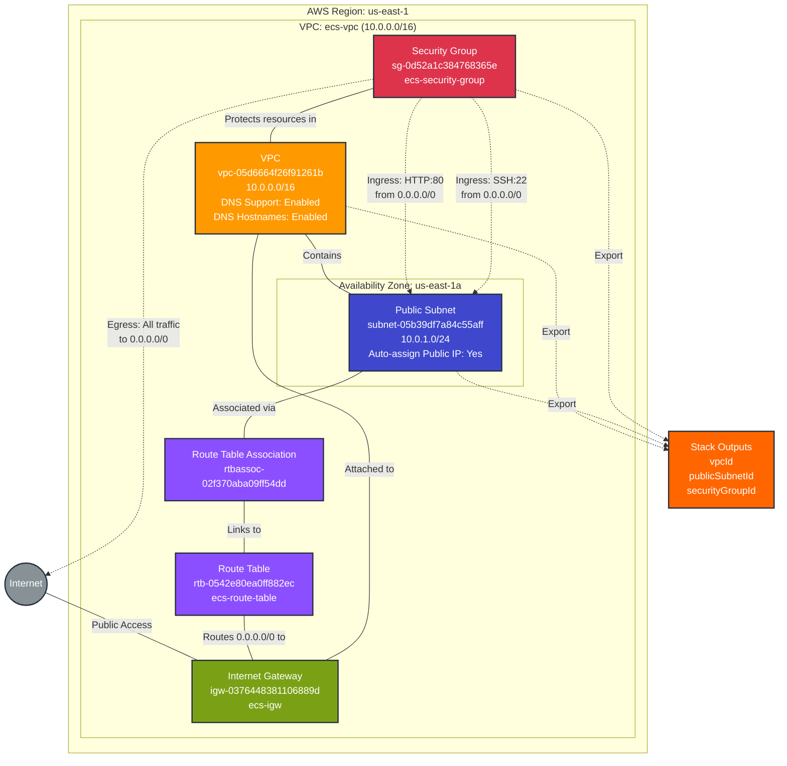

# Network Infrastructure Stack - networkstack

This diagram shows the network infrastructure resources deployed in the `network-infrastructure` networkstack stack.

## Resources Summary

### Core Network Components

- **VPC**: `vpc-05d6664f26f91261b` (ecs-vpc)
  - CIDR Block: 10.0.0.0/16
  - DNS Support: Enabled
  - DNS Hostnames: Enabled
  - Tenancy: default

- **Public Subnet**: `subnet-05b39df7a84c55aff` (ecs-public-subnet)
  - CIDR Block: 10.0.1.0/24
  - Availability Zone: us-east-1a
  - Auto-assign Public IP: Yes
  - Map Public IP on Launch: Yes

- **Internet Gateway**: `igw-0376448381106889d` (ecs-igw)
  - Attached to VPC: vpc-05d6664f26f91261b

- **Route Table**: `rtb-0542e80ea0ff882ec` (ecs-route-table)
  - Routes:
    - 0.0.0.0/0 → igw-0376448381106889d (Internet Gateway)

- **Route Table Association**: `rtbassoc-02f370aba09ff54dd`
  - Associates subnet-05b39df7a84c55aff with rtb-0542e80ea0ff882ec

### Security Configuration

- **Security Group**: `sg-0d52a1c384768365e` (ecs-security-group)
  - VPC: vpc-05d6664f26f91261b
  - Description: Allow HTTP and SSH traffic
  
  **Ingress Rules**:
  - HTTP (TCP port 80) from 0.0.0.0/0
  - SSH (TCP port 22) from 0.0.0.0/0
  
  **Egress Rules**:
  - All traffic (all protocols) to 0.0.0.0/0

## Stack Exports

This stack exports the following outputs for use by other stacks:

- **vpcId**: `vpc-05d6664f26f91261b` - VPC identifier for resource placement
- **publicSubnetId**: `subnet-05b39df7a84c55aff` - Public subnet for ECS tasks and services
- **securityGroupId**: `sg-0d52a1c384768365e` - Security group for network access control

## Architecture Overview

This stack provides the foundational networking infrastructure for ECS-based workloads. It creates a simple, production-ready network topology with public internet access.

### Key Features

1. **Public Subnet Architecture**: Single public subnet with direct internet access via Internet Gateway
2. **DNS Support**: Both DNS support and DNS hostnames enabled for service discovery
3. **Flexible Security**: Security group allows HTTP and SSH access from anywhere (can be restricted as needed)
4. **Stack Outputs**: Exports key resource IDs for consumption by dependent stacks

### Network Design

- **VPC CIDR**: 10.0.0.0/16 (65,536 IP addresses)
- **Subnet CIDR**: 10.0.1.0/24 (256 IP addresses)
- **Availability Zone**: us-east-1a (single AZ deployment)
- **Internet Routing**: All traffic (0.0.0.0/0) routes through Internet Gateway

## Dependencies

### Consumed By

- **ecs-cluster stack** (when deployed): References `publicSubnetId` for ECS service placement
- **Future stacks**: Can reference `vpcId`, `publicSubnetId`, and `securityGroupId` as needed

### Depends On

- None - This is a foundational stack with no dependencies

## Repository

- **Source**: github.com/lichtie/prod-infrastructure
- **Directory**: `/network`
- **Language**: TypeScript
- **Provider**: AWS (version 6.13.3)

## Operational Considerations

### High Availability

- ⚠️ **Single AZ**: Resources deployed in us-east-1a only
- **Recommendation**: Consider multi-AZ deployment for production workloads requiring high availability

### Security

- ⚠️ **Broad SSH Access**: SSH allowed from 0.0.0.0/0
- **Recommendation**: Restrict SSH access to specific IP ranges or use AWS Systems Manager Session Manager
- ✅ **Egress Control**: All outbound traffic allowed (typical for most workloads)

### Scalability

- ✅ **Large VPC**: /16 CIDR provides ample IP space for growth
- ✅ **Subnet Capacity**: /24 subnet supports 256 IPs (sufficient for many ECS tasks)
- **Future**: Can add additional subnets in other AZs as needed

## Tags

All resources are tagged with descriptive names:
- VPC: `ecs-vpc`
- Subnet: `ecs-public-subnet`
- Internet Gateway: `ecs-igw`
- Route Table: `ecs-route-table`
- Security Group: `ecs-security-group`
