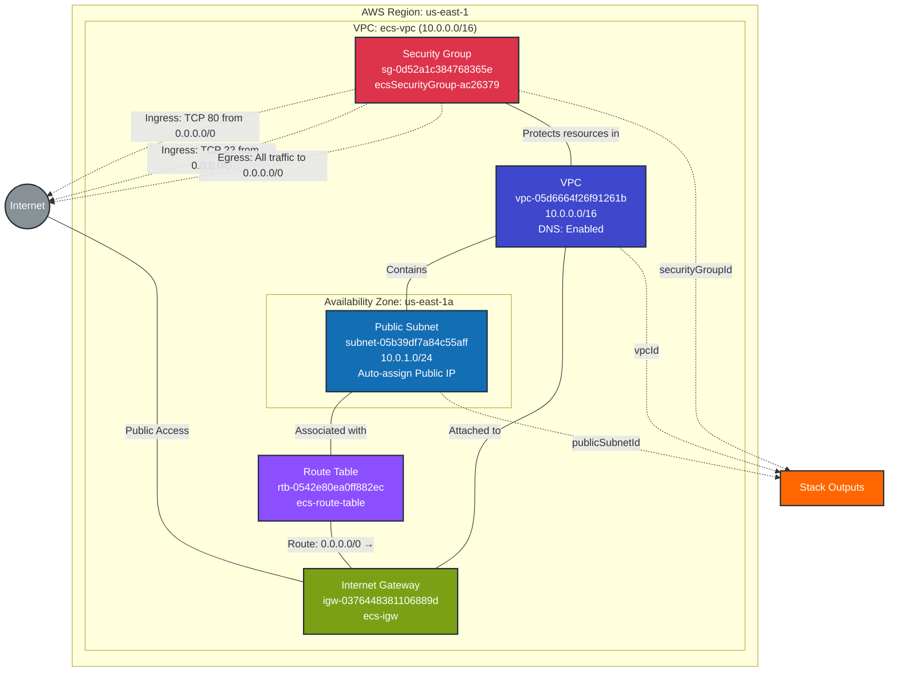

# Network Infrastructure Stack - Production

This diagram shows the network infrastructure resources deployed in the `network-infrastructure` prod stack.

## Resources Summary

### Core Network Components

- **VPC**: `vpc-05d6664f26f91261b` (ecs-vpc)
  - CIDR Block: `10.0.0.0/16`
  - DNS Support: Enabled
  - DNS Hostnames: Enabled
  - Instance Tenancy: Default
  - ARN: `arn:aws:ec2:us-east-1:052848974346:vpc/vpc-05d6664f26f91261b`

- **Public Subnet**: `subnet-05b39df7a84c55aff` (ecs-public-subnet)
  - CIDR Block: `10.0.1.0/24`
  - Availability Zone: `us-east-1a` (AZ ID: use1-az1)
  - Auto-assign Public IP: Enabled
  - ARN: `arn:aws:ec2:us-east-1:052848974346:subnet/subnet-05b39df7a84c55aff`

- **Internet Gateway**: `igw-0376448381106889d` (ecs-igw)
  - Attached to VPC: `vpc-05d6664f26f91261b`
  - ARN: `arn:aws:ec2:us-east-1:052848974346:internet-gateway/igw-0376448381106889d`

- **Route Table**: `rtb-0542e80ea0ff882ec` (ecs-route-table)
  - Routes:
    - `0.0.0.0/0` → `igw-0376448381106889d` (Internet Gateway)
  - Associated with: `subnet-05b39df7a84c55aff`
  - ARN: `arn:aws:ec2:us-east-1:052848974346:route-table/rtb-0542e80ea0ff882ec`

- **Security Group**: `sg-0d52a1c384768365e` (ecsSecurityGroup-ac26379)
  - Description: Allow HTTP and SSH traffic
  - VPC: `vpc-05d6664f26f91261b`
  - ARN: `arn:aws:ec2:us-east-1:052848974346:security-group/sg-0d52a1c384768365e`

### Security Configuration

#### Ingress Rules
- **HTTP**: TCP port 80 from `0.0.0.0/0` (anywhere)
- **SSH**: TCP port 22 from `0.0.0.0/0` (anywhere)

#### Egress Rules
- **All Traffic**: All protocols, all ports to `0.0.0.0/0` (anywhere)

### Stack Exports

This stack exports the following outputs for use by other stacks:

- `vpcId`: `vpc-05d6664f26f91261b`
- `publicSubnetId`: `subnet-05b39df7a84c55aff`
- `securityGroupId`: `sg-0d52a1c384768365e`

## Stack Information

- **Project**: `network-infrastructure`
- **Stack**: `networkstack`
- **Organization**: `elisabeth-demo`
- **Environment**: `prod`
- **Repository**: `github.com/lichtie/prod-infrastructure`
- **Path**: `network/`
- **Provider**: AWS (pulumi-aws v6.13.3)
- **Region**: us-east-1

## Dependencies

- **Consumed by**: Stacks requiring VPC and networking resources for ECS or other compute deployments
- **Note**: While originally created for the cluster-infrastructure stack, these network resources remain available for future deployments
