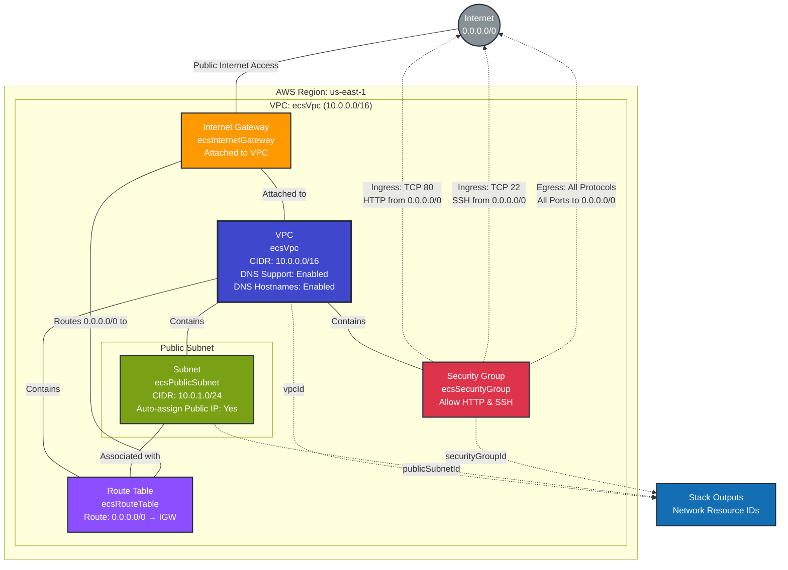

# Network Infrastructure Stack - Production

This diagram shows the network infrastructure resources deployed in the `network-infrastructure` prod stack.

## Resources Summary

### Core Network Components

- **VPC**: `ecsVpc` (10.0.0.0/16)
  - DNS Support: Enabled
  - DNS Hostnames: Enabled
  - Tag: `Name=ecs-vpc`
- **Public Subnet**: `ecsPublicSubnet` (10.0.1.0/24)
  - Auto-assign Public IP: Enabled
  - Tag: `Name=ecs-public-subnet`
- **Internet Gateway**: `ecsInternetGateway`
  - Attached to VPC
  - Tag: `Name=ecs-igw`
- **Route Table**: `ecsRouteTable`
  - Default route: 0.0.0.0/0 → Internet Gateway
  - Tag: `Name=ecs-route-table`
- **Security Group**: `ecsSecurityGroup`
  - Description: "Allow HTTP and SSH traffic"
  - Tag: `Name=ecs-security-group`

### Security Configuration

- **Ingress Rules**: HTTP (port 80) and SSH (port 22) from anywhere (0.0.0.0/0)
- **Egress Rules**: All traffic allowed to anywhere

### Stack Exports

This stack exports the following outputs for use by other stacks:

- `vpcId`: VPC identifier
- `publicSubnetId`: Public subnet identifier
- `securityGroupId`: Security group identifier

## Dependencies

- **Consumed by**: `cluster-infrastructure` stack (for ECS deployment)
