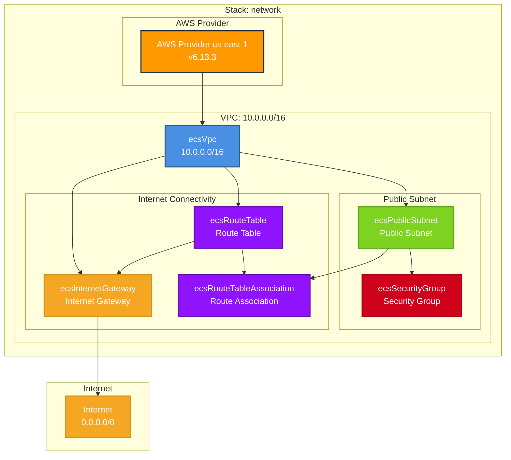

# Network Stack Architecture

## Overview
The Network stack provides the foundational networking infrastructure for the production ECS environment. It creates a VPC with public subnets, internet connectivity, and security groups required for containerized workloads.

## Resources
Key resources deployed by this stack:
- **ecsVpc**: Main VPC with 10.0.0.0/16 CIDR block
- **ecsPublicSubnet**: Public subnet for ECS tasks
- **ecsInternetGateway**: Internet gateway for public connectivity
- **ecsRouteTable**: Route table with internet routing
- **ecsRouteTableAssociation**: Associates route table with subnet
- **ecsSecurityGroup**: Security group for ECS services

## Dependencies
- **Stack References**: None (foundational stack)
- **External Dependencies**: AWS VPC service, EC2 networking

## Architecture Diagram

## Configuration
Key configuration values used by this stack:
- **AWS Region**: us-east-1
- **AWS Provider Version**: 6.13.3
- **VPC CIDR**: 10.0.0.0/16
- **DNS Support**: Enabled
- **DNS Hostnames**: Enabled

## Outputs
Key outputs that other stacks reference:
- **vpcId**: VPC identifier for resource placement
- **publicSubnetId**: Subnet for ECS task placement
- **securityGroupId**: Security group for ECS services

## Network Configuration

### VPC Details
- **CIDR Block**: 10.0.0.0/16 (65,536 IP addresses)
- **Instance Tenancy**: Default
- **DNS Resolution**: Enabled
- **DNS Hostnames**: Enabled

### Routing Configuration
- **Default Route**: 0.0.0.0/0 → Internet Gateway
- **Local Route**: 10.0.0.0/16 → Local (implicit)

### Security Groups
- **Default Security Group**: Created automatically
- **ECS Security Group**: Custom security group for ECS services

## Notes
This is a foundational networking stack that provides:
- Public internet connectivity for ECS Fargate tasks
- Secure network isolation through VPC
- Scalable subnet architecture ready for expansion
- Security group framework for service-level access control

The network is designed to support containerized workloads with public internet access, suitable for web applications and APIs.