# Networking and Bucket Stack Architecture

## Overview
The Networking and Bucket stack provides comprehensive networking infrastructure with both public and private subnets, NAT gateway for secure outbound connectivity, and S3 storage. This stack creates a production-ready VPC architecture with proper subnet segmentation and internet connectivity patterns.

## Resources
Key resources deployed by this stack:
- **main-vpc**: VPC with 10.29.0.0/16 CIDR block
- **public-subnet-1, public-subnet-2**: Public subnets for internet-facing resources
- **private-subnet-1**: Private subnet for backend resources
- **main-igw**: Internet gateway for public connectivity
- **main-nat**: NAT gateway for private subnet outbound access
- **nat-eip**: Elastic IP for NAT gateway
- **public-rt, private-rt**: Route tables for traffic routing
- **my-bucket**: S3 bucket for object storage

## Dependencies
- **Stack References**: None (foundational stack)
- **External Dependencies**: AWS VPC service, S3 service

## Architecture Diagram

```mermaid
graph TB
    %% Define AWS service icon styles
    classDef awsNetwork fill:#FF9900,stroke:#232F3E,stroke-width:2px,color:#fff
    classDef awsStorage fill:#FF9900,stroke:#232F3E,stroke-width:2px,color:#fff
    classDef internet fill:#28A745,stroke:#155724,stroke-width:2px,color:#fff

    subgraph "Stack: networking_and_bucket"
        subgraph "🌐 VPC Infrastructure"
            VPC["🏢 main-vpc<br/>10.29.0.0/16<br/>DNS: Enabled<br/>Hostnames: Enabled"]:::awsNetwork

            subgraph "🌍 Public Subnets"
                PUB1["🌐 public-subnet-1<br/>10.29.1.0/24<br/>us-east-1b<br/>Auto-assign Public IP"]:::awsNetwork
                PUB2["🌐 public-subnet-2<br/>10.29.2.0/24<br/>us-east-1b<br/>Auto-assign Public IP"]:::awsNetwork
            end

            subgraph "🔒 Private Subnets"
                PRIV1["🏠 private-subnet-1<br/>10.29.10.0/24<br/>us-east-1b<br/>No Public IP"]:::awsNetwork
            end
        end

        subgraph "🚪 Internet Connectivity"
            IGW["🌐 main-igw<br/>Internet Gateway<br/>Public Access"]:::awsNetwork
            
            subgraph "🔄 NAT Infrastructure"
                EIP["📍 nat-eip<br/>Elastic IP<br/>54.173.5.81"]:::awsNetwork
                NAT["🔄 main-nat<br/>NAT Gateway<br/>Public Connectivity<br/>Private IP: 10.29.1.237"]:::awsNetwork
            end
        end

        subgraph "📋 Routing"
            PUB_RT["📋 public-rt<br/>Public Route Table<br/>0.0.0.0/0 → IGW"]:::awsNetwork
            PRIV_RT["📋 private-rt<br/>Private Route Table<br/>0.0.0.0/0 → NAT"]:::awsNetwork
            
            subgraph "🔗 Route Associations"
                PUB_ASSOC1["🔗 public-rt-association-1<br/>Public Subnet 1"]:::awsNetwork
                PUB_ASSOC2["🔗 public-rt-association-2<br/>Public Subnet 2"]:::awsNetwork
                PRIV_ASSOC1["🔗 private-rt-association-1<br/>Private Subnet 1"]:::awsNetwork
            end
        end

        subgraph "💾 Storage"
            S3["💾 my-bucket<br/>S3 Bucket<br/>AES256 Encryption<br/>my-bucket-e2de00c"]:::awsStorage
        end
    end

    subgraph "🌍 External"
        INTERNET["🌐 Internet<br/>0.0.0.0/0<br/>Public Traffic"]:::internet
    end

    %% VPC relationships
    VPC --> PUB1
    VPC --> PUB2
    VPC --> PRIV1
    VPC --> IGW
    VPC --> PUB_RT
    VPC --> PRIV_RT

    %% NAT Gateway relationships
    EIP --> NAT
    NAT --> PUB1
    
    %% Route table relationships
    PUB_RT --> PUB_ASSOC1
    PUB_RT --> PUB_ASSOC2
    PUB_RT --> IGW
    PRIV_RT --> PRIV_ASSOC1
    PRIV_RT --> NAT

    %% Subnet associations
    PUB_ASSOC1 --> PUB1
    PUB_ASSOC2 --> PUB2
    PRIV_ASSOC1 --> PRIV1

    %% Internet connectivity
    IGW --> INTERNET
    NAT -.-> IGW
    IGW -.-> INTERNET

    %% Traffic flow indicators
    PUB1 -.-> IGW
    PUB2 -.-> IGW
    PRIV1 -.-> NAT
```

## Configuration
Key configuration values used by this stack:
- **AWS Region**: us-east-1
- **AWS Provider Version**: 7.5.0
- **VPC CIDR**: 10.29.0.0/16
- **Availability Zone**: us-east-1b (all subnets)
- **DNS Support**: Enabled
- **DNS Hostnames**: Enabled

## Network Architecture Details

### VPC Configuration
- **CIDR Block**: 10.29.0.0/16 (65,536 IP addresses)
- **Instance Tenancy**: Default
- **DNS Resolution**: Enabled
- **DNS Hostnames**: Enabled
- **VPC ID**: vpc-0cb9f942dd73da389

### Subnet Configuration

#### Public Subnets
- **public-subnet-1**: 10.29.1.0/24 (256 IPs) - subnet-042f1f255da8bd5c1
- **public-subnet-2**: 10.29.2.0/24 (256 IPs) - subnet-08dbcd27ae5b70733
- **Auto-assign Public IP**: Enabled
- **Availability Zone**: us-east-1b

#### Private Subnets
- **private-subnet-1**: 10.29.10.0/24 (256 IPs) - subnet-0fa21184e073d1c18
- **Auto-assign Public IP**: Disabled
- **Availability Zone**: us-east-1b

### NAT Gateway Configuration
- **NAT Gateway ID**: nat-0de8cb125a316ff1a
- **Elastic IP**: 54.173.5.81 (eipalloc-0c51152d684718eeb)
- **Private IP**: 10.29.1.237
- **Subnet**: public-subnet-1
- **Connectivity Type**: Public

### Routing Configuration

#### Public Route Table (rtb-0e8ce04913f629382)
- **Default Route**: 0.0.0.0/0 → Internet Gateway
- **Local Route**: 10.29.0.0/16 → Local (implicit)
- **Associated Subnets**: public-subnet-1, public-subnet-2

#### Private Route Table (rtb-014c64f47957d509d)
- **Default Route**: 0.0.0.0/0 → NAT Gateway
- **Local Route**: 10.29.0.0/16 → Local (implicit)
- **Associated Subnets**: private-subnet-1

## S3 Storage Configuration

### Bucket Details
- **Bucket Name**: my-bucket-e2de00c
- **Region**: us-east-1
- **Encryption**: AES256 (server-side)
- **Versioning**: Disabled
- **Object Lock**: Disabled
- **Public Access**: Blocked (default)

## Outputs
Key outputs that other stacks might reference:
- **vpcId**: VPC identifier for resource placement
- **publicSubnetIds**: Public subnet IDs for internet-facing resources
- **privateSubnetIds**: Private subnet IDs for backend resources
- **natGatewayId**: NAT gateway for private subnet routing
- **bucketName**: S3 bucket name for storage operations

## Security Considerations

### Network Security
- **Private Subnet Isolation**: Backend resources isolated from direct internet access
- **NAT Gateway**: Secure outbound internet access for private resources
- **Route Table Separation**: Distinct routing for public and private subnets

### Storage Security
- **S3 Encryption**: Server-side encryption with AES256
- **Access Control**: Default bucket policies block public access
- **Regional Storage**: Data stored in us-east-1 region

## Scalability Patterns

### Current Architecture
- **Single AZ**: All subnets in us-east-1b
- **NAT Gateway**: Single NAT for cost optimization
- **Subnet Sizing**: /24 subnets provide 256 IPs each

### Expansion Opportunities
- **Multi-AZ Deployment**: Add subnets in us-east-1a, us-east-1c
- **Additional NAT Gateways**: One per AZ for high availability
- **Subnet Segmentation**: Additional private subnets for database tiers
- **VPC Peering**: Connect to other VPCs for hybrid architectures

## Cost Optimization

### Current Costs
- **VPC**: No additional charges for basic networking
- **NAT Gateway**: Hourly charges + data processing fees
- **Elastic IP**: Free when associated with running NAT Gateway
- **S3**: Pay-per-use storage and requests

### Optimization Strategies
- **NAT Instance**: Consider NAT instance for lower-traffic scenarios
- **S3 Storage Classes**: Use appropriate storage classes for access patterns
- **VPC Endpoints**: Add S3 VPC endpoint to reduce NAT Gateway data charges

## Notes
This stack provides a production-ready networking foundation with:
- **Proper subnet segmentation** between public and private resources
- **Secure outbound connectivity** via NAT Gateway for private subnets
- **Scalable storage** with S3 integration
- **Cost-effective single-AZ design** suitable for development/staging environments
- **Ready for expansion** to multi-AZ architecture when needed

The architecture follows AWS best practices for VPC design and provides a solid foundation for hosting both public-facing and private backend services.