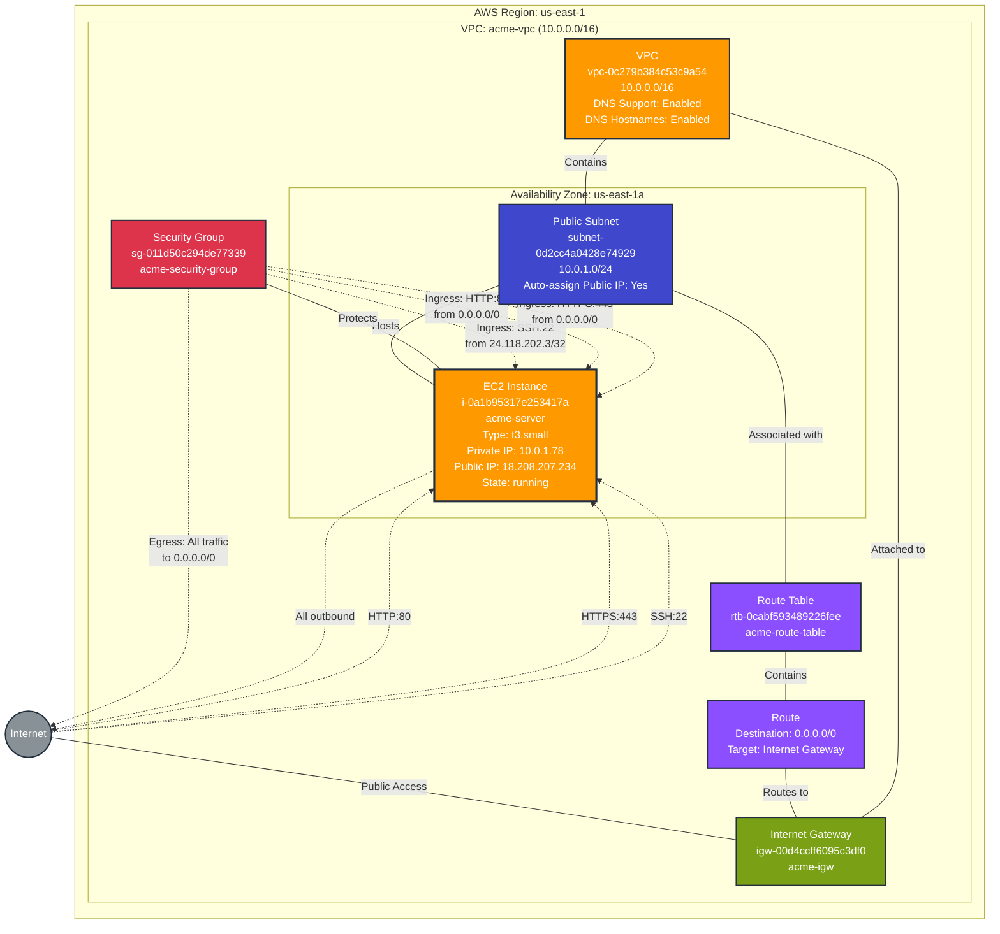

# Server Infrastructure Stack - Production

This diagram shows the server infrastructure resources deployed in the `server-infra` prod stack.

## Resources Summary

### Compute Resources

- **EC2 Instance**: `i-0a1b95317e253417a` (acme-server)
  - Instance Type: t3.small
  - AMI: ami-0030e4319cbf4dbf2
  - Key Pair: elisabeth-key-pair
  - Private IP: 10.0.1.78
  - Public IP: 18.208.207.234
  - Public DNS: ec2-18-208-207-234.compute-1.amazonaws.com
  - State: running
  - Availability Zone: us-east-1a

### Network Components

- **VPC**: `vpc-0c279b384c53c9a54` (acme-vpc)
  - CIDR Block: 10.0.0.0/16
  - DNS Support: Enabled
  - DNS Hostnames: Enabled
  - Tenancy: default

- **Public Subnet**: `subnet-0d2cc4a0428e74929` (acme-public-subnet)
  - CIDR Block: 10.0.1.0/24
  - Availability Zone: us-east-1a
  - Auto-assign Public IP: Yes
  - Map Public IP on Launch: Yes

- **Internet Gateway**: `igw-00d4ccff6095c3df0` (acme-igw)
  - Attached to VPC: vpc-0c279b384c53c9a54

- **Route Table**: `rtb-0cabf593489226fee` (acme-route-table)
  - Associated with subnet: subnet-0d2cc4a0428e74929
  - Routes:
    - 0.0.0.0/0 → igw-00d4ccff6095c3df0 (Internet Gateway)

### Security Configuration

- **Security Group**: `sg-011d50c294de77339` (acme-security-group)
  - VPC: vpc-0c279b384c53c9a54
  - Description: Security group for ACME server
  
  **Ingress Rules**:
  - SSH (TCP port 22) from 24.118.202.3/32 - SSH access from specific IP
  - HTTP (TCP port 80) from 0.0.0.0/0 - HTTP for ACME HTTP-01 challenges
  - HTTPS (TCP port 443) from 0.0.0.0/0 - HTTPS for ACME protocol
  
  **Egress Rules**:
  - All traffic (all protocols) to 0.0.0.0/0 - Allow all outbound traffic

## Architecture Overview

This stack deploys a single EC2 instance in a public subnet with internet connectivity. The infrastructure is designed to support an ACME server that handles certificate challenges and HTTPS traffic.

### Key Features

1. **Public Internet Access**: The EC2 instance has a public IP address and is accessible from the internet through the Internet Gateway
2. **Secure SSH Access**: SSH access is restricted to a specific IP address (24.118.202.3/32)
3. **ACME Protocol Support**: Open HTTP (80) and HTTPS (443) ports for ACME certificate challenges and protocol operations
4. **Simple Network Topology**: Single VPC with one public subnet in a single availability zone

### Data Flow

1. **Inbound Traffic**:
   - Internet → Internet Gateway → Route Table → Public Subnet → EC2 Instance
   - Security Group filters traffic based on protocol and source IP

2. **Outbound Traffic**:
   - EC2 Instance → Public Subnet → Route Table → Internet Gateway → Internet
   - All outbound traffic is allowed

### Operational Considerations

- **Single Point of Failure**: The instance is deployed in a single availability zone without redundancy
- **Public Exposure**: The instance is directly accessible from the internet on ports 80 and 443
- **SSH Security**: SSH access is properly restricted to a single IP address
- **Instance Type**: t3.small provides 2 vCPUs and 2 GB RAM with burstable performance

## Dependencies

- **Stack Outputs**: This stack does not currently export any outputs for consumption by other stacks
- **External Dependencies**: None - this is a standalone stack

## Tags

All resources are tagged with descriptive names for easy identification:
- VPC: `acme-vpc`
- Subnet: `acme-public-subnet`
- Internet Gateway: `acme-igw`
- Route Table: `acme-route-table`
- Security Group: `acme-security-group`
- EC2 Instance: `acme-server`
