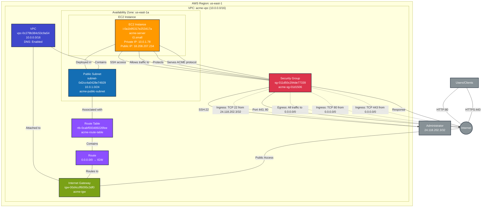

# Server Infrastructure Stack - Production

This diagram shows the ACME server infrastructure deployed in the `server-infra` prod stack.

## Resources Summary

### Compute Resources

- **EC2 Instance**: `i-0a1b95317e253417a` (acme-server)
  - Instance Type: `t3.small`
  - AMI: `ami-0030e4319cbf4dbf2`
  - Key Pair: `elisabeth-key-pair`
  - Private IP: `10.0.1.78`
  - Public IP: `18.208.207.234`
  - Public DNS: `ec2-18-208-207-234.compute-1.amazonaws.com`
  - State: `running`
  - Availability Zone: `us-east-1a`
  - ARN: `arn:aws:ec2:us-east-1:052848974346:instance/i-0a1b95317e253417a`
  - Root Volume: 20 GB gp3 (3000 IOPS, 125 MB/s throughput)

### Network Resources

- **VPC**: `vpc-0c279b384c53c9a54` (acme-vpc)
  - CIDR Block: `10.0.0.0/16`
  - DNS Support: Enabled
  - DNS Hostnames: Enabled
  - Instance Tenancy: Default
  - ARN: `arn:aws:ec2:us-east-1:052848974346:vpc/vpc-0c279b384c53c9a54`

- **Public Subnet**: `subnet-0d2cc4a0428e74929` (acme-public-subnet)
  - CIDR Block: `10.0.1.0/24`
  - Availability Zone: `us-east-1a` (AZ ID: use1-az1)
  - Auto-assign Public IP: Enabled
  - ARN: `arn:aws:ec2:us-east-1:052848974346:subnet/subnet-0d2cc4a0428e74929`

- **Internet Gateway**: `igw-00d4ccff6095c3df0` (acme-igw)
  - Attached to VPC: `vpc-0c279b384c53c9a54`
  - ARN: `arn:aws:ec2:us-east-1:052848974346:internet-gateway/igw-00d4ccff6095c3df0`

- **Route Table**: `rtb-0cabf593489226fee` (acme-route-table)
  - Routes:
    - `0.0.0.0/0` → `igw-00d4ccff6095c3df0` (Internet Gateway)
  - Associated with: `subnet-0d2cc4a0428e74929`
  - ARN: `arn:aws:ec2:us-east-1:052848974346:route-table/rtb-0cabf593489226fee`

- **Security Group**: `sg-011d50c294de77339` (acme-sg-01d1506)
  - Description: Security group for ACME server
  - VPC: `vpc-0c279b384c53c9a54`
  - ARN: `arn:aws:ec2:us-east-1:052848974346:security-group/sg-011d50c294de77339`

### Security Configuration

#### Ingress Rules
- **HTTPS**: TCP port 443 from `0.0.0.0/0` (ACME protocol)
- **HTTP**: TCP port 80 from `0.0.0.0/0` (ACME HTTP-01 challenges)
- **SSH**: TCP port 22 from `24.118.202.3/32` (restricted admin access)

#### Egress Rules
- **All Traffic**: All protocols, all ports to `0.0.0.0/0` (anywhere)

## Architecture Overview

### Purpose
This stack deploys an ACME (Automated Certificate Management Environment) server for SSL/TLS certificate management and issuance.

### Key Features
- **Public Accessibility**: Server is deployed in a public subnet with a public IP address
- **ACME Protocol Support**: Ports 443 (HTTPS) and 80 (HTTP) open for ACME protocol operations
- **Secure SSH Access**: SSH access restricted to a specific IP address (24.118.202.3/32)
- **Isolated Network**: Dedicated VPC separate from other infrastructure

### Data Flow

#### Certificate Issuance Flow
1. **Client Request** → Internet → Internet Gateway
2. **Network Routing** → VPC → Public Subnet
3. **Security Filtering** → Security Group (allows HTTPS:443, HTTP:80)
4. **ACME Processing** → EC2 Instance processes certificate requests
5. **Response Path** → Reverse of request flow

#### Administrative Access Flow
1. **Admin Connection** → SSH from 24.118.202.3/32
2. **Security Filtering** → Security Group (allows SSH:22 from specific IP)
3. **Server Access** → EC2 Instance management

### Operational Considerations

#### Security Posture
- ✅ SSH access restricted to specific IP address
- ✅ Dedicated VPC isolates ACME server from other infrastructure
- ✅ Security group with defined ingress rules
- ⚠️ Public subnet with internet access (required for ACME protocol)
- ⚠️ HTTP port 80 open (required for ACME HTTP-01 challenges)

#### High Availability
- ⚠️ Single instance deployment (no redundancy)
- ⚠️ Single AZ deployment (consider multi-AZ for production)
- ℹ️ Consider adding Auto Scaling Group for HA

#### Monitoring & Maintenance
- Instance monitoring via CloudWatch (basic metrics)
- Manual updates and patching required
- Consider adding CloudWatch Logs agent for application logs

## Stack Information

- **Project**: `server-infra`
- **Stack**: `prod`
- **Organization**: `elisabeth-demo`
- **Environment**: `prod`
- **Provider**: AWS (pulumi-aws v7.14.0)
- **Region**: us-east-1

## Dependencies

- **No dependencies**: This stack is self-contained with its own VPC and networking resources
- **Independent from**: IAM and Network infrastructure stacks (separate VPC)
