# Production Infrastructure Overview

## Architecture Summary
High-level overview of the entire production infrastructure across all stacks.

## Stack Relationships
Description of how stacks relate to each other and share resources through StackReferences.

## Master Architecture Diagram

```mermaid
graph TB
    %% Define cloud provider icon styles
    classDef awsCompute fill:#FF9900,stroke:#232F3E,stroke-width:2px,color:#fff
    classDef awsNetwork fill:#FF9900,stroke:#232F3E,stroke-width:2px,color:#fff
    classDef awsStorage fill:#FF9900,stroke:#232F3E,stroke-width:2px,color:#fff
    classDef awsDatabase fill:#FF9900,stroke:#232F3E,stroke-width:2px,color:#fff
    classDef awsSecurity fill:#FF9900,stroke:#232F3E,stroke-width:2px,color:#fff
    classDef gcpCompute fill:#4285F4,stroke:#1a73e8,stroke-width:2px,color:#fff
    classDef gcpNetwork fill:#4285F4,stroke:#1a73e8,stroke-width:2px,color:#fff
    classDef gcpStorage fill:#4285F4,stroke:#1a73e8,stroke-width:2px,color:#fff
    classDef azureCompute fill:#0078D4,stroke:#005a9e,stroke-width:2px,color:#fff
    classDef azureNetwork fill:#0078D4,stroke:#005a9e,stroke-width:2px,color:#fff
    classDef k8s fill:#326CE5,stroke:#1e3a8a,stroke-width:2px,color:#fff
    classDef stackref fill:#9C27B0,stroke:#6A1B9A,stroke-width:2px,color:#fff
    classDef internet fill:#28A745,stroke:#155724,stroke-width:2px,color:#fff

    %% Example structure - replace with actual stacks and relationships
    subgraph "Production Environment"
        subgraph "Foundation Stack"
            VPC["🌐 VPC<br/>Network Foundation"]:::awsNetwork
            IAM["🔐 IAM Roles<br/>Security"]:::awsSecurity
        end

        subgraph "Compute Stack"
            ECS["🐳 ECS Cluster<br/>Container Orchestration"]:::awsCompute
            TASKS["📦 Task Definitions<br/>Application Specs"]:::awsCompute
        end

        subgraph "Data Stack"
            RDS["🗄️ RDS Database<br/>Persistent Storage"]:::awsDatabase
            S3["💾 S3 Buckets<br/>Object Storage"]:::awsStorage
        end
    end

    subgraph "External Services"
        INTERNET["🌍 Internet<br/>Public Access"]:::internet
        EXTERNAL["☁️ Third-party APIs<br/>External Integration"]
    end

    %% Stack relationships via StackReferences
    IAM --> ECS
    VPC --> ECS
    ECS --> TASKS
    TASKS --> RDS
    TASKS --> S3

    %% External connections
    INTERNET --> ECS
    TASKS --> EXTERNAL
```

## Data Flow
Description of how data flows between stacks and external systems.

## Security Boundaries
Overview of security zones, network boundaries, and access controls.

## Disaster Recovery
High-level disaster recovery strategy and cross-stack dependencies.

## Monitoring & Observability
Overview of monitoring, logging, and alerting across all stacks.