# {Stack Name} Architecture

## Overview
Brief description of what this stack provides and its purpose in the overall architecture.

## Resources
List of key resources deployed by this stack:
- Resource 1: Description
- Resource 2: Description

## Dependencies
- **Stack References**: List any stacks this depends on
- **External Dependencies**: APIs, services, or resources outside Pulumi management

## Architecture Diagram

```mermaid
graph TB
    %% Define cloud provider icon styles
    classDef awsCompute fill:#FF9900,stroke:#232F3E,stroke-width:2px,color:#fff
    classDef awsNetwork fill:#FF9900,stroke:#232F3E,stroke-width:2px,color:#fff
    classDef awsStorage fill:#FF9900,stroke:#232F3E,stroke-width:2px,color:#fff
    classDef awsDatabase fill:#FF9900,stroke:#232F3E,stroke-width:2px,color:#fff
    classDef awsSecurity fill:#FF9900,stroke:#232F3E,stroke-width:2px,color:#fff
    classDef gcpCompute fill:#4285F4,stroke:#1a73e8,stroke-width:2px,color:#fff
    classDef gcpNetwork fill:#4285F4,stroke:#1a73e8,stroke-width:2px,color:#fff
    classDef gcpStorage fill:#4285F4,stroke:#1a73e8,stroke-width:2px,color:#fff
    classDef azureCompute fill:#0078D4,stroke:#005a9e,stroke-width:2px,color:#fff
    classDef azureNetwork fill:#0078D4,stroke:#005a9e,stroke-width:2px,color:#fff
    classDef k8s fill:#326CE5,stroke:#1e3a8a,stroke-width:2px,color:#fff
    classDef stackref fill:#9C27B0,stroke:#6A1B9A,stroke-width:2px,color:#fff

    %% Example structure - replace with actual resources
    subgraph "Stack: {stack-name}"
        subgraph "Compute Resources"
            COMPUTE["🖥️ Compute Instance<br/>Type: t3.medium"]:::awsCompute
        end
        
        subgraph "Network Resources"
            VPC["🌐 VPC<br/>CIDR: 10.0.0.0/16"]:::awsNetwork
            SUBNET["🔗 Subnet<br/>Public/Private"]:::awsNetwork
        end
        
        subgraph "Storage Resources"
            STORAGE["💾 S3 Bucket<br/>Encrypted"]:::awsStorage
        end
    end

    subgraph "Stack References"
        STACKREF["📋 Other Stack<br/>StackReference"]:::stackref
    end

    subgraph "External Services"
        EXTERNAL["☁️ External API<br/>Third-party"]
    end

    %% Infrastructure relationships
    VPC --> SUBNET
    SUBNET --> COMPUTE
    COMPUTE --> STORAGE
    STACKREF --> COMPUTE
    COMPUTE --> EXTERNAL
```

## Configuration
Key configuration values and secrets used by this stack:
- Config 1: Description
- Secret 1: Description

## Outputs
Key outputs that other stacks might reference:
- Output 1: Description
- Output 2: Description

## Notes
Any additional notes about the architecture, deployment considerations, or known limitations.